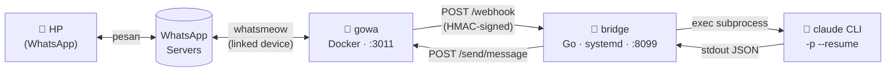

# claude-whatsapp

[English](README.md) · **Bahasa Indonesia**

Chat dengan [Claude Code](https://claude.com/claude-code) lewat WhatsApp. Pesan masuk memicu satu panggilan `claude -p` di mesin Anda sendiri, dan hasilnya dikirim balik sebagai balasan WhatsApp — lengkap dengan lampiran (gambar, dokumen) dan voice note. Percakapan berlanjut per chat lewat `claude --resume`.


**Isi:** [Cara kerja](#cara-kerja) · [Baca ini dulu](#baca-ini-dulu-keamanan) · [Mulai cepat](#mulai-cepat) · [Admin UI](#admin-ui) · [Konfigurasi](#konfigurasi) · [Upgrade & uninstall](#upgrade--uninstall) · [Instalasi manual](#instalasi-manual-dari-source) · [Troubleshooting](#troubleshooting) · [Fitur](#fitur)

## Cara kerja

Dibangun di atas [gowa](https://github.com/aldinokemal/go-whatsapp-web-multidevice) (klien WhatsApp tidak resmi, Go + [whatsmeow](https://github.com/tulir/whatsmeow)) yang memegang koneksi WhatsApp sebagai container Docker, dan sebuah bridge Go kecil (repo ini) yang menyambungkannya ke Claude Code CLI.



Sengaja dibuat sesederhana mungkin: **tidak ada proses interaktif yang harus dijaga hidup**. gowa berdiri sendiri sebagai container (mudah di-restart), bridge cuma HTTP server headless biasa (`systemd --user`, `Restart=always`), dan tiap pesan = satu panggilan `claude -p` yang berdiri sendiri. Detail lengkap: [`docs/ARCHITECTURE.md`](docs/ARCHITECTURE.md).

Ada dua nomor WhatsApp yang berperan:

| | Fungsi | Di mana diatur |
|---|---|---|
| **Nomor bot** | Nomor yang **ditautkan** ke gowa sebagai *linked device* — ke nomor inilah Anda mengirim pesan. Sebaiknya nomor khusus, bukan nomor utama Anda. | Pairing lewat [Admin UI](#3-tautkan-whatsapp) |
| **Nomor pengirim** | Nomor HP **Anda** yang boleh memberi perintah ke bot. Pesan dari nomor lain diabaikan. | `ALLOWED_SENDERS` di `.env` |

## Baca ini dulu (keamanan)

- **Ini bukan sandbox.** `claude -p` dijalankan sebagai user Linux yang memasang bridge, dengan `--permission-mode auto`. Siapa pun di `ALLOWED_SENDERS` (atau anggota grup di `ALLOWED_GROUPS`) pada dasarnya bisa membuat Claude membaca file dan menjalankan perintah di mesin itu — termasuk `sudo` kalau user tersebut punya `sudo` tanpa password. Daftarkan hanya nomor yang Anda percaya penuh, dan pertimbangkan memasangnya di user terpisah/VM tanpa hak istimewa. Rincian di [`docs/ARCHITECTURE.md` §11](docs/ARCHITECTURE.md#11-keamanan).
- **Klien WhatsApp tidak resmi.** gowa/whatsmeow bukan produk resmi WhatsApp; penggunaannya bisa bertentangan dengan ketentuan layanan dan berisiko membuat akun dibatasi. Pakai dengan risiko sendiri — sebaiknya dengan nomor khusus.
- **Rahasiakan `.env` dan `data/`.** `.env` berisi secret webhook dan password gowa; `data/whatsapp/` adalah sesi WhatsApp yang aktif (akses penuh ke akun bot). Keduanya ada di `.gitignore` — jangan pernah di-commit atau dibagikan.
- **Admin UI hanya untuk Anda.** Halaman admin bisa menautkan ulang WhatsApp dan mengganti login Claude. Default-nya cuma bisa dibuka dari mesin itu sendiri; jangan diekspos ke internet. Lihat [Admin UI](#admin-ui).

## Mulai cepat

### 1. Prasyarat

- Linux dengan **systemd** (dites di Raspberry Pi 5 / aarch64 Debian 13; dibangun juga untuk armv7 dan x86_64)
- [Docker](https://docs.docker.com/engine/install/) + plugin Docker Compose, dan user Anda ada di grup `docker`
- [Claude Code CLI](https://docs.claude.com/claude-code) terpasang dan ada di `PATH` (`npm install -g @anthropic-ai/claude-code`) — login akunnya bisa dilakukan sesudah instalasi, lewat Admin UI
- Sebuah nomor WhatsApp untuk dijadikan bot, dan HP untuk memindai QR-nya

Go **tidak** dibutuhkan untuk cara ini.

### 2. Pasang

Jalankan sebagai **user biasa, bukan `sudo`**:

```bash
curl -sSL https://raw.githubusercontent.com/tarkiman/claude-whatsapp/main/scripts/quick-install.sh | bash
```

Installer mengunduh rilis siap pakai, menanyakan **nomor pengirim** Anda (nomor HP Anda dengan kode negara, tanpa 0 di depan — mis. `6281234567890`), membuat `.env` dengan secret acak, menjalankan gowa via Docker Compose, dan memasang service bridge + admin. Semuanya masuk ke `~/claude-whatsapp`.

<details>
<summary>Opsi installer</summary>

```bash
curl -sSL .../quick-install.sh | bash -s -- --allowed-senders 6281234567890 --non-interactive
```

| Opsi | Fungsi |
|---|---|
| `--allowed-senders <nomor[,nomor]>` | nomor pengirim, tanpa perlu ditanya interaktif |
| `--dir <path>` | lokasi instalasi (default `~/claude-whatsapp`) |
| `--version <tag>` | pasang versi tertentu, mis. `v0.1.0` (default: rilis terbaru) |
| `--gowa-port <port>` | port gowa di host (default `3011`) |
| `--skip-start` | cuma siapkan `.env`, jangan jalankan Docker/service |
| `--non-interactive` | jangan bertanya apa pun |

</details>

### 3. Tautkan WhatsApp

Buka Admin UI di **http://127.0.0.1:8098** (dari komputer lain: [SSH tunnel](#akses-dari-komputer-lain)). Kartu **WhatsApp recovery** → **Show pairing QR**, lalu di HP bot: *WhatsApp → Perangkat tertaut → Tautkan perangkat* dan pindai QR-nya. QR berlaku 30 detik; halaman menampilkan status berhasil sendiri. Kalau lebih mudah dengan kode, isi nomor bot lalu **Get code**.


### 4. Login Claude

Kartu **Sign in / switch Claude account**: klik **Sign in…**, buka link yang muncul di perangkat mana saja, login dengan akun Claude Anda, lalu tempel kode yang ditampilkan halaman itu ke kolom "paste code" dan **Submit code**. Kalau kartu **Claude account** di atas sudah menunjukkan `Logged in: yes`, langkah ini bisa dilewati.


Login ini dipakai bersama oleh **semua** sesi Claude Code di user Linux itu, bukan hanya bridge; bridge langsung memakai login baru di pesan berikutnya tanpa restart. Alternatif lewat terminal: `claude auth login`.

### 5. Coba

Dari nomor pengirim, kirim pesan WhatsApp apa saja ke nomor bot. Status keseluruhan harus **All good** di Admin UI. Kalau tidak ada balasan, lihat [Troubleshooting](#troubleshooting).

## Admin UI

Halaman status dan pemulihan di `http://127.0.0.1:8098`, berjalan sebagai service terpisah (`claude-whatsapp-admin`) supaya tetap bisa dibuka justru saat bridge yang bermasalah.

- **Status** — bridge, gowa, dan akun Claude dalam satu layar, dengan penanda **All good / Degraded / Down** beserta alasannya, plus log bridge dan gowa.
- **WhatsApp recovery** — Reconnect (coba ini dulu kalau status disconnected), pairing QR, pairing lewat kode, dan **Unlink** untuk pindah ke nomor bot lain.
- **Sign in / switch Claude account** — login atau ganti akun tanpa membuka terminal.

Status `Down` + "WhatsApp is logged out" berarti sesi WhatsApp dihapus (mis. device di-unlink dari HP, atau HP utama offline terlalu lama). Bot tidak membalas apa pun sampai ditautkan ulang — dan tidak ada alarm lain yang berbunyi, jadi sesekali cek halaman ini.

### Akses dari komputer lain

Default-nya halaman ini **hanya listen di `127.0.0.1`**. Dari laptop/HP, buka lewat SSH tunnel:

```bash
ssh -L 8098:127.0.0.1:8098 <user>@<ip-mesin-bot>     # lalu buka http://localhost:8098
```

Atau buka langsung dari LAN/[ZeroTier](https://www.zerotier.com/) dengan mengisi `.env` (lalu `systemctl --user restart claude-whatsapp-admin`):

```bash
ADMIN_ADDR=127.0.0.1:8098,192.168.1.20:8098,10.147.20.15:8098   # IP spesifik mesin ini; 0.0.0.0 ditolak
ADMIN_ALLOWED_NETS=192.168.1.0/24,10.147.0.0/16                  # hanya klien dari jaringan ini yang dilayani
ADMIN_PASSWORD=<acak-dan-panjang>                                # opsional tapi sangat disarankan
```

Klien di luar `ADMIN_ALLOWED_NETS` langsung ditolak (403), dan IP yang belum ada saat boot (mis. interface ZeroTier) dicoba ulang tiap 5 detik. Ini HTTP biasa: pembatasan jaringan saja tidak melindungi dari sesama pengguna jaringan yang sama, jadi isi `ADMIN_PASSWORD` kalau jaringannya tidak sepenuhnya Anda percaya, dan jangan buka ke internet publik.

## Konfigurasi

Semua lewat `.env` di direktori instalasi (`chmod 600`; template lengkap dengan komentar: [`.env.example`](.env.example), tabel referensi: [`docs/ARCHITECTURE.md` §13](docs/ARCHITECTURE.md#13-konfigurasi-env-var)). Installer mengisi yang wajib; sisanya punya default yang masuk akal.

| Variabel | Fungsi |
|---|---|
| `ALLOWED_SENDERS` | **Wajib.** Nomor pengirim yang boleh memberi perintah (JID `6281…@s.whatsapp.net`, pisah koma). Bridge menolak start kalau kosong. |
| `ALLOWED_GROUPS` | Opsional. JID grup (`…@g.us`) yang boleh memakai bot; kosong = DM saja. Sekali grup didaftarkan, **semua** anggotanya bisa memicu bot. |
| `WEBHOOK_SECRET` | Kunci HMAC antara gowa dan bridge — dibuat acak oleh installer. |
| `GOWA_BASIC_AUTH_USER/PASSWORD` | Kredensial REST API gowa — password dibuat acak oleh installer. |
| `WORK_DIR` | Direktori kerja `claude -p` (default `$HOME`; di sinilah `CLAUDE.md` Anda terbaca). |
| `ADMIN_ADDR`, `ADMIN_ALLOWED_NETS`, `ADMIN_PASSWORD` | Akses Admin UI — lihat [di atas](#akses-dari-komputer-lain). |

Untuk mengubah `.env`: edit lalu `systemctl --user restart claude-whatsapp.service claude-whatsapp-admin.service` (dan `docker compose up -d` di direktori instalasi kalau yang diubah menyangkut gowa).

## Upgrade & uninstall

**Upgrade** — jalankan perintah instalasi yang sama lagi. Binary dan script diganti, `.env` dan `data/` (sesi WhatsApp) dibiarkan. Hindari upgrade saat ada percakapan aktif: restart mematikan proses `claude -p` yang sedang berjalan.

**Uninstall:**

```bash
systemctl --user disable --now claude-whatsapp.service claude-whatsapp-admin.service
rm ~/.config/systemd/user/claude-whatsapp.service ~/.config/systemd/user/claude-whatsapp-admin.service
systemctl --user daemon-reload
cd ~/claude-whatsapp && docker compose down
sudo rm -rf ~/claude-whatsapp ~/.claude-whatsapp   # sudo: file di data/ dimiliki user di dalam container
```

Lalu keluarkan device bot dari HP (*Perangkat tertaut* → pilih perangkat → *Keluar*) supaya sesinya benar-benar dicabut.

## Instalasi manual (dari source)

Untuk pengembangan atau kalau tidak mau memakai installer. Butuh tambahan [Go](https://go.dev/dl/) 1.26+.

```bash
git clone https://github.com/tarkiman/claude-whatsapp.git && cd claude-whatsapp
cp .env.example .env && chmod 600 .env
```

Edit `.env`: isi `WEBHOOK_SECRET` (`openssl rand -hex 32`), ganti `GOWA_BASIC_AUTH_PASSWORD` (di **kedua** tempatnya), dan isi `ALLOWED_SENDERS` dengan nomor pengirim (`6281234567890@s.whatsapp.net`). Lalu:

```bash
docker compose up -d      # gowa + sidecar perbaikan permission lampiran
scripts/deploy.sh         # build bridge + admin, pasang service systemd --user (idempotent)
```

Lanjutkan dengan [langkah 3 dan 4](#3-tautkan-whatsapp) di atas. `scripts/deploy.sh` aman dijalankan ulang tiap ada perubahan kode (build ulang, regenerate unit dengan path & `$PATH` mesin Anda, restart eksplisit).

<details>
<summary>Pairing WhatsApp tanpa Admin UI (curl)</summary>

API multi-device baru gowa (`/devices/{id}/login*`) belum stabil di image `:latest` — pakai endpoint legacy dengan `device_id` eksplisit:

```bash
source .env
DEVICE_ID=$(curl -s -u "$GOWA_BASIC_AUTH_USER:$GOWA_BASIC_AUTH_PASSWORD" \
  -X POST "http://localhost:${GOWA_PORT:-3011}/devices" -H "Content-Type: application/json" -d '{}' \
  | python3 -c 'import json,sys;print(json.load(sys.stdin)["results"]["id"])')

# ganti <nomor> dengan nomor bot (kode negara + nomor, tanpa +)
curl -s -u "$GOWA_BASIC_AUTH_USER:$GOWA_BASIC_AUTH_PASSWORD" \
  "http://localhost:${GOWA_PORT:-3011}/app/login-with-code?phone=<nomor>&device_id=$DEVICE_ID"

# tunggu sampai "is_logged_in": true (field "state" di /devices bisa "connected" prematur)
curl -s -u "$GOWA_BASIC_AUTH_USER:$GOWA_BASIC_AUTH_PASSWORD" \
  "http://localhost:${GOWA_PORT:-3011}/app/status?device_id=$DEVICE_ID"
```

`pair_code` (`XXXX-XXXX`) langsung dimasukkan di HP (*Tautkan perangkat → Tautkan dengan nomor telepon*) sebelum kedaluwarsa (~2-3 menit). Sesi tersimpan di `./data/whatsapp`, jadi restart tidak perlu pairing ulang.

</details>

<details>
<summary>Transkripsi voice note (opsional)</summary>

```bash
scripts/setup-whisper.sh
```

Membangun `whisper.cpp` dari source dan memasang model multilingual `base` ke `data/whisper/ggml-base.bin` (~150MB, sekali download). Butuh `cmake` dan `ffmpeg`. Tanpa langkah ini voice note tetap terkirim ke Claude, hanya sebagai instruksi "minta pengirim ketik ulang" — fiturnya nonaktif otomatis, tidak ada yang rusak.

</details>

## Troubleshooting

Mulai dari [Admin UI](#admin-ui): status, alasan, dan log biasanya sudah menunjuk masalahnya.

| Gejala | Kemungkinan penyebab | Cek |
|---|---|---|
| Bot diam total, padahal service `active` | Sesi WhatsApp terhapus/di-unlink (Admin UI: `Down` + "logged out"), atau gowa sempat putus koneksi | Admin UI → **Reconnect**, atau pairing ulang. `docker logs claude-whatsapp-gowa` |
| Tidak ada balasan sama sekali | `claude` tidak ketemu di `$PATH` milik service systemd, atau belum login | `journalctl --user -u claude-whatsapp.service -n 50` — cari `executable file not found`; cek kartu **Claude account** |
| Balasan generik "ada error di sisi saya" | `claude -p` gagal/timeout, atau endpoint gowa lain gagal | Log yang sama — pesan errornya spesifik |
| Log bridge "replied ok" tapi pesan tidak sampai | "replied ok" hanya berarti API gowa menjawab 2xx, bukan bahwa WhatsApp mengirimnya — biasanya gowa sedang disconnect | Admin UI: `Connected: no` → **Reconnect** |
| Webhook tidak pernah sampai ke bridge | Signature HMAC tidak cocok (`WEBHOOK_SECRET` beda antara `.env` dan container gowa), atau bridge belum jalan | `docker logs claude-whatsapp-gowa`, `curl localhost:8099/health` |
| Pairing gagal / `is_logged_in: false` terus | Field `state` "connected" itu prematur — hanya `is_logged_in: true` yang bisa dipercaya | `curl .../app/status?device_id=...` |
| `… is not implemented yet` | Endpoint device-manager baru (`/devices/{id}/login*`) belum matang di gowa `:latest` | Pakai Admin UI atau endpoint legacy (`/app/login*?device_id=`) |
| Kirim foto/dokumen, Claude bilang tidak bisa baca file (permission denied) | gowa menyimpan lampiran `0600` milik user internal container | Pastikan sidecar jalan: `docker ps \| grep media-perms-fix`; kalau tidak ada, `docker compose up -d` |
| Installer: "tidak menemukan rilis" | Belum ada rilis untuk arsitektur Anda, atau tidak bisa mengakses GitHub | Pasang manual (di atas) |

## Fitur

- **Teks** — dua arah, dengan kontinuitas sesi per chat.
- **Lampiran** — gambar, video, dokumen (PDF dkk — Claude membacanya langsung lewat tool Read), dan stiker.
- **Voice note** — ditranskrip otomatis secara lokal (`whisper.cpp`, multilingual, tanpa API cloud) sebelum dikirim ke `claude -p`. Opsional. Di Raspberry Pi 5 (4 thread CPU), model `base` ~2.3x lebih cepat dari real-time.
- **Durability** — pesan ditulis ke antrian on-disk (`~/.claude-whatsapp/pending/`) sebelum di-ack ke gowa, dan direplay otomatis kalau bridge sempat mati di tengah proses.
- **Satu `claude -p` per chat pada satu waktu** — dikunci per `chat_id`; pesan lain untuk chat yang sama antre, bukan berebut sesi `--resume` yang sama.
- **Access control per grup** — `ALLOWED_GROUPS` terpisah dari `ALLOWED_SENDERS`. Sekali grup didaftarkan, semua anggotanya bisa memicu bot (gowa tidak memberi data @-mention di webhook, lihat [`docs/ARCHITECTURE.md` §10](docs/ARCHITECTURE.md#10-access-control-per-grup)).
- **Admin UI** — status, pemulihan WhatsApp, dan login Claude ([di atas](#admin-ui)).

**Belum diimplementasikan:** mention-gating di grup (keterbatasan data dari gowa), approval tool-call lewat reaction emoji, dan rate limiting lintas-chat (tiap chat berbeda = proses `claude -p` sendiri, tanpa batas jumlah paralel). Kontribusi/PR dipersilakan.

## Struktur repo

```
claude-whatsapp/
├── cmd/bridge/main.go               # entrypoint bridge
├── cmd/admin/main.go                # entrypoint Admin UI
├── internal/
│   ├── admin/                       # handler Admin UI + web/index.html (di-embed)
│   ├── config/                      # baca & validasi .env
│   ├── gowa/                        # REST client ke gowa
│   ├── webhook/                     # verifikasi HMAC, parsing lampiran, orkestrasi
│   ├── claude/                      # exec claude -p, parse JSON
│   ├── session/                     # chat_id -> session_id
│   ├── pending/                     # antrian durable — replay setelah crash
│   └── transcribe/                  # exec whisper-cli untuk voice note
├── docker-compose.yml               # gowa + sidecar perbaikan permission
├── deploy/                          # template unit systemd (bridge, admin)
├── scripts/
│   ├── quick-install.sh             # installer satu-baris (curl | bash)
│   ├── install.sh                   # .env + gowa (Docker) + service systemd
│   ├── deploy.sh                    # build (kalau ada Go + source) / pakai bin/ + pasang service
│   ├── package-release.sh           # cross-compile + tarball per arsitektur
│   └── setup-whisper.sh             # whisper.cpp + model (opsional)
├── .github/workflows/release.yml    # tag v* -> publish tarball arm64/armv7/amd64
└── docs/                            # ARCHITECTURE.md, images/
```

**Merilis versi baru:** `git tag v0.x.0 && git push origin v0.x.0` — workflow menjalankan test lalu menerbitkan tarball yang diunduh `quick-install.sh`.

## Lisensi

[MIT](LICENSE). Perangkat lunak ini disediakan apa adanya, tanpa jaminan apa pun — lihat juga [peringatan keamanan](#baca-ini-dulu-keamanan).
