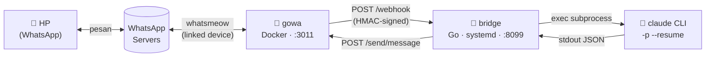

# claude-whatsapp

[English](README.md) · **Bahasa Indonesia**

Chat dengan [Claude Code](https://claude.com/claude-code) lewat WhatsApp. Pesan masuk memicu satu panggilan `claude -p` di mesin Anda sendiri, dan hasilnya dikirim balik sebagai balasan WhatsApp — lengkap dengan lampiran (gambar, dokumen) dan voice note. Percakapan berlanjut per chat lewat `claude --resume`.


**Isi:** [Cara kerja](#cara-kerja) · [Baca ini dulu](#baca-ini-dulu-keamanan) · [Mulai cepat](#mulai-cepat) · [Siapa yang boleh memerintah bot](#siapa-yang-boleh-memerintah-bot) · [Admin UI](#admin-ui) · [Konfigurasi](#konfigurasi) · [Upgrade & uninstall](#upgrade--uninstall) · [Instalasi manual](#instalasi-manual-dari-source) · [Troubleshooting](#troubleshooting) · [Fitur](#fitur)

## Cara kerja

Dibangun di atas [gowa](https://github.com/aldinokemal/go-whatsapp-web-multidevice) (klien WhatsApp tidak resmi, Go + [whatsmeow](https://github.com/tulir/whatsmeow)) yang memegang koneksi WhatsApp sebagai container Docker, dan sebuah bridge Go kecil (repo ini) yang menyambungkannya ke Claude Code CLI.


```mermaid
flowchart LR
    Phone["📱 HP\n(WhatsApp)"] <-->|pesan| WA[("WhatsApp\nServers")]
    WA <-->|"whatsmeow\n(linked device)"| Gowa["🐳 gowa\nDocker · :3011"]
    Gowa -->|"POST /webhook\n(HMAC-signed)"| Bridge["🌉 bridge\nGo · systemd · :8099"]
    Bridge -->|"exec subprocess"| Claude["🤖 claude CLI\n-p --resume"]
    Claude -->|"stdout JSON"| Bridge
    Bridge -->|"POST /send/message"| Gowa
```

Sengaja dibuat sesederhana mungkin: **tidak ada proses interaktif yang harus dijaga hidup**. gowa berdiri sendiri sebagai container (mudah di-restart), bridge cuma HTTP server headless biasa (`systemd --user`, `Restart=always`), dan tiap pesan = satu panggilan `claude -p` yang berdiri sendiri. Detail lengkap: [`docs/ARCHITECTURE.id.md`](docs/ARCHITECTURE.id.md).

Ada dua nomor WhatsApp yang berperan:

| | Fungsi | Di mana diatur |
|---|---|---|
| **Nomor bot** | Nomor yang **ditautkan** ke gowa sebagai *linked device* — ke nomor inilah Anda mengirim pesan. Sebaiknya nomor khusus, bukan nomor utama Anda. | Pairing lewat [Admin UI](#3-tautkan-whatsapp) |
| **Nomor pengirim** | Nomor HP **Anda** yang boleh memberi perintah ke bot. Pesan dari nomor lain diabaikan. | Admin UI → *Who can instruct the bot* (diisi awal dari `ALLOWED_SENDERS` di `.env`) |

## Baca ini dulu (keamanan)

- **Ini bukan sandbox.** `claude -p` dijalankan sebagai user Linux yang memasang bridge, dengan `--permission-mode auto`. Siapa pun yang boleh memerintah bot (satu nomor di mode personal, setiap anggota yang disetujui di mode tim) pada dasarnya bisa membuat Claude membaca file dan menjalankan perintah di mesin itu — termasuk `sudo` kalau user tersebut punya `sudo` tanpa password. Izinkan hanya orang yang Anda percaya penuh, dan pertimbangkan memasangnya di user terpisah/VM tanpa hak istimewa. Rincian di [`docs/ARCHITECTURE.id.md` §11](docs/ARCHITECTURE.id.md#11-keamanan).
- **Kebijakan akses adalah satu-satunya gerbang — lindungi akun yang ada di dalamnya.** Apa pun dari nomor yang tidak diizinkan diabaikan sebelum ada yang dijalankan (pencocokannya persis, lihat [`docs/ARCHITECTURE.id.md` §10](docs/ARCHITECTURE.id.md#10-access-control-mode-personal-dan-tim)), dan file kebijakan yang rusak membuat semua orang ditolak. Tapi siapa pun yang menguasai akun WhatsApp yang diizinkan menguasai mesin ini, jadi aktifkan verifikasi dua langkah WhatsApp untuknya. Konten yang diteruskan orang yang diizinkan (pesan, dokumen) juga bisa berisi instruksi yang ditujukan ke Claude — perlakukan konten teruskan seperti sesuatu yang akan Anda jalankan sendiri.
- **Klien WhatsApp tidak resmi.** gowa/whatsmeow bukan produk resmi WhatsApp; penggunaannya bisa bertentangan dengan ketentuan layanan dan berisiko membuat akun dibatasi. Pakai dengan risiko sendiri — sebaiknya dengan nomor khusus.
- **Rahasiakan `.env` dan `data/`.** `.env` berisi secret webhook dan password gowa; `data/whatsapp/` adalah sesi WhatsApp yang aktif (akses penuh ke akun bot). Keduanya ada di `.gitignore` — jangan pernah di-commit atau dibagikan.
- **Admin UI hanya untuk Anda.** Halaman admin bisa menautkan ulang WhatsApp, mengganti login Claude, dan menentukan siapa yang boleh memerintah bot. Ia punya login sendiri (username + password, hanya hash-nya yang disimpan), default-nya cuma bisa dibuka dari mesin itu sendiri, dan tidak boleh diekspos ke internet. Lihat [Admin UI](#admin-ui).

## Mulai cepat

### 1. Prasyarat

- Linux dengan **systemd** (dites di Raspberry Pi 5 / aarch64 Debian 13; dibangun juga untuk armv7 dan x86_64)
- [Docker](https://docs.docker.com/engine/install/) + plugin Docker Compose, dan user Anda ada di grup `docker`
- [Claude Code CLI](https://docs.claude.com/claude-code) terpasang dan ada di `PATH` (`npm install -g @anthropic-ai/claude-code`) — login akunnya bisa dilakukan sesudah instalasi, lewat Admin UI
- Sebuah nomor WhatsApp untuk dijadikan bot, dan HP untuk memindai QR-nya

Go **tidak** dibutuhkan untuk cara ini.

### 2. Pasang

Jalankan sebagai **user biasa, bukan `sudo`**:

```bash
curl -sSL https://raw.githubusercontent.com/tarkiman/claude-whatsapp/main/scripts/quick-install.sh | bash
```

Installer mengunduh rilis siap pakai, menanyakan **nomor pengirim** Anda (nomor HP Anda dengan kode negara, tanpa 0 di depan — mis. `6281234567890`) dan **username serta password halaman admin** (diketik tanpa tampil di layar; minimal 10 karakter dengan minimal 5 karakter berbeda — frasa pendek dari kata-kata yang tidak berhubungan sudah cukup), membuat `.env` dengan secret acak, menjalankan gowa via Docker Compose, dan memasang service bridge + admin. Semuanya masuk ke `~/claude-whatsapp`.

<details>
<summary>Opsi installer</summary>

```bash
curl -sSL .../quick-install.sh | bash -s -- --allowed-senders 6281234567890 --non-interactive
```

| Opsi | Fungsi |
|---|---|
| `--allowed-senders <nomor[,nomor]>` | nomor pengirim, tanpa perlu ditanya interaktif |
| `--dir <path>` | lokasi instalasi (default `~/claude-whatsapp`) |
| `--version <tag>` | pasang versi tertentu, mis. `v0.1.0` (default: rilis terbaru) |
| `--admin-user <nama>` | username login halaman admin (kalau tidak diberikan ditanya, default `admin`). Password ditanya tanpa tampil di layar, atau — saat non-interaktif — dibaca dari *variabel lingkungan* `ADMIN_PASSWORD` (bukan flag, supaya tidak masuk riwayat shell) |
| `--gowa-port <port>` | port gowa di host (default `3011`) |
| `--tarball <file>` | pakai tarball rilis lokal alih-alih mengunduh |
| `--skip-start` | cuma siapkan `.env`, jangan jalankan Docker/service |
| `--non-interactive` | jangan bertanya apa pun |

</details>

### 3. Tautkan WhatsApp

Buka Admin UI di **http://127.0.0.1:8098** (dari komputer lain: [SSH tunnel](#akses-dari-komputer-lain)) dan masuk dengan username serta password yang Anda pilih saat instalasi. Di kartu **WhatsApp recovery** klik **Show pairing QR**, lalu di HP bot: *WhatsApp → Perangkat tertaut → Tautkan perangkat* dan pindai QR-nya. QR berlaku 30 detik; halaman menampilkan status berhasil sendiri. Kalau lebih mudah dengan kode, isi nomor bot lalu **Get code**.


### 4. Login Claude

Kartu **Sign in / switch Claude account**: klik **Sign in…**, buka link yang muncul di perangkat mana saja, login dengan akun Claude Anda, lalu tempel kode yang ditampilkan halaman itu ke kolom "paste code" dan **Submit code**. Kalau kartu **Claude account** di atas sudah menunjukkan `Logged in: yes`, langkah ini bisa dilewati.


Login ini dipakai bersama oleh **semua** sesi Claude Code di user Linux itu, bukan hanya bridge; bridge langsung memakai login baru di pesan berikutnya tanpa restart. Alternatif lewat terminal: `claude auth login`.

### 5. Coba

Dari nomor pengirim, kirim pesan WhatsApp apa saja ke nomor bot. Status keseluruhan harus **All good** di Admin UI. Kalau tidak ada balasan, lihat [Troubleshooting](#troubleshooting).

Setelah instalasi bot ada di **mode personal**: hanya nomor pengirim Anda yang bisa memerintahnya, dan grup diabaikan. Supaya sebuah tim bisa memakainya di grup WhatsApp, lihat [Siapa yang boleh memerintah bot](#siapa-yang-boleh-memerintah-bot).

## Siapa yang boleh memerintah bot

Instruksi menjadi perintah di mesin Anda, jadi bot hanya punya dua mode, keduanya diatur dari kartu **Who can instruct the bot** di [Admin UI](#admin-ui). Perubahan berlaku mulai pesan berikutnya — tanpa restart.

| | **Personal** (default) | **Tim** |
|---|---|---|
| Siapa | tepat satu nomor telepon | anggota satu grup WhatsApp yang Anda setujui |
| Di mana | hanya pesan langsung; grup diabaikan | hanya grup itu; DM diabaikan |
| Pemicu | pesan apa pun | hanya pesan yang **@mention bot** |
| Orang baru | — | ditolak sampai Anda mencentangnya |


**Mode personal** adalah yang Anda dapat setelah instalasi, memakai nomor yang Anda berikan ke installer. Untuk menggantinya, ketik nomor lain di kartu itu lalu simpan — selalu hanya ada satu.

**Mode tim** — tujuannya agen bersama yang bisa dilihat kerjanya oleh seluruh tim:

1. Buat grup WhatsApp dan tambahkan **nomor bot** ke dalamnya, beserta rekan tim Anda.
2. Di Admin UI pilih **Team**, tekan **Load groups**, pilih grupnya. Anggota grup saat ini muncul dengan satu kotak centang masing-masing.
3. Centang orang yang boleh memerintah bot (atau **Approve all current members**) lalu tekan **Save team**.
4. Anggota yang disetujui menulis `@bot <permintaan>` di grup. Bot menjawab **di grup, mengutip permintaannya**, sehingga semua orang melihat progresnya. Semua berbagi satu sesi Claude per grup, dan bot tahu siapa yang sedang bicara.

Hal yang perlu diketahui:

- **Persetujuan bersifat eksplisit.** Orang yang ditambahkan ke grup WhatsApp belakangan *tidak* diizinkan sampai Anda mencentangnya di kartu; roster kosong berarti tidak ada yang diizinkan. Pesan yang tidak me-mention bot adalah obrolan biasa dan diabaikan, siapa pun penulisnya.
- **Setiap anggota yang disetujui pada dasarnya administrator mesin ini** (lihat [keamanan](#baca-ini-dulu-keamanan)). Untuk tim, jalankan bridge sebagai user khusus tanpa hak istimewa atau di VM, arahkan `WORK_DIR` ke folder proyek alih-alih `$HOME`, dan hindari `sudo` tanpa password.
- **Privasi.** WhatsApp mengirim setiap pesan grup ke akun bot, dan gowa menyimpan salinan semuanya (termasuk obrolan yang tidak pernah me-mention bot) di `data/whatsapp/chatstorage.db`. Beri tahu tim Anda bahwa akun bot bisa melihat seluruh grup.
- **Mention harus berupa @mention sungguhan** (pilih bot dari saran saat mengetik `@`). Deteksi dilakukan pada teks pesan, dengan menerima nomor telepon bot atau LID WhatsApp-nya. Kalau tidak bereaksi, set `LOG_GROUP_MESSAGES=1` di `.env`, restart, mention bot sekali lalu baca `journalctl --user -u claude-whatsapp.service` — baris `group-message:` menunjukkan persis apa yang datang dan kenapa diterima atau diabaikan (ini mencatat teks pesan, jadi matikan lagi).
- Orang yang oleh WhatsApp hanya dikenal lewat ID internal (tanpa nomor telepon yang terlihat) tidak bisa disetujui; kartu menandainya.

## Admin UI

Halaman status dan pemulihan di `http://127.0.0.1:8098`, berjalan sebagai service terpisah (`claude-whatsapp-admin`) supaya tetap bisa dibuka justru saat bridge yang bermasalah.

- **Status** — bridge, gowa, dan akun Claude dalam satu layar, dengan penanda **All good / Degraded / Down** beserta alasannya, plus log bridge dan gowa.
- **Siapa yang boleh memerintah bot** — mode personal atau tim, satu nomor, grup beserta anggota yang disetujui ([di atas](#siapa-yang-boleh-memerintah-bot)).
- **WhatsApp recovery** — Reconnect (coba ini dulu kalau status disconnected), pairing QR, pairing lewat kode, dan **Unlink** untuk pindah ke nomor bot lain.
- **Sign in / switch Claude account** — login atau ganti akun tanpa membuka terminal.
- **Login admin** — username dan password (hanya hash yang disimpan), keluar, dan ganti password dari halaman; lihat [di bawah](#login-admin).

Status `Down` + "WhatsApp is logged out" berarti sesi WhatsApp dihapus (mis. device di-unlink dari HP, atau HP utama offline terlalu lama). Bot tidak membalas apa pun sampai ditautkan ulang — dan tidak ada alarm lain yang berbunyi, jadi sesekali cek halaman ini.

### Login admin

Halaman ini berada di balik login sendiri: **satu akun**, username dan password dipilih saat instalasi. Password disimpan hanya sebagai hash PBKDF2 ber-salt di `~/.claude-whatsapp/admin.json` (mode `0600`), tidak pernah di `.env`, dan tidak pernah dikirim ke mana pun. Cookie sesi (`HttpOnly`, `SameSite=Strict`) membuat Anda tetap masuk paling lama 12 jam (30 menit kalau tidak aktif); admin yang restart membuat semua orang keluar.

- **Aturan password:** minimal 10 karakter, dengan minimal 5 karakter berbeda. Tidak dipaksa memakai angka atau simbol — frasa pendek dari kata-kata yang tidak berhubungan (dengan spasi) boleh dan lebih mudah diingat daripada deretan acak. Kalau password ditolak, pesannya menyebut semua aturan yang dilanggar, lengkap dengan angkanya.
- **Ganti password** di kartu *Admin login* (meminta password saat ini; semua browser lain otomatis keluar). **Log out** ada di kanan atas.
- **Tebakan dibatasi:** setelah 5 password salah, klien dikunci 5 menit, dan menggandakan waktunya setiap kali terulang (sampai satu jam).
- **Lupa password?** Di mesin itu sendiri jalankan `~/claude-whatsapp/bin/admin passwd` (atau `bin/admin passwd` di checkout source). Perintah ini hanya bisa dijalankan di sana, oleh user yang memang sudah bisa membaca filenya, jadi tidak butuh login. Dengan `--user` Anda juga bisa mengganti nama akun.
- **Belum ada akun** (misalnya setelah instalasi manual atau upgrade dari v0.1.x): halaman login menawarkan *Create the admin login* — **hanya untuk browser di mesin itu sendiri**. Dari tempat lain (LAN, ZeroTier) halamannya hanya meminta Anda melakukannya secara lokal atau menjalankan `bin/admin passwd`, sehingga tidak ada orang lain yang bisa mengklaimnya lebih dulu.
- Ini tetap HTTP biasa di LAN: password bisa dibaca orang lain di jaringan yang sama, dan cookie tidak bisa diberi flag `Secure`. Pilih ZeroTier (terenkripsi) atau SSH tunnel, atau pasang TLS di depannya; jangan pernah membuka halaman ini ke internet.

### Akses dari komputer lain

Default-nya halaman ini **hanya listen di `127.0.0.1`**. Dari laptop/HP, buka lewat SSH tunnel:

```bash
ssh -L 8098:127.0.0.1:8098 <user>@<ip-mesin-bot>     # lalu buka http://localhost:8098
```

Atau buka langsung dari LAN/[ZeroTier](https://www.zerotier.com/) dengan mengisi `.env` (lalu `systemctl --user restart claude-whatsapp-admin`):

```bash
ADMIN_ADDR=127.0.0.1:8098,192.168.1.20:8098,10.147.20.15:8098   # IP spesifik mesin ini; 0.0.0.0 ditolak
ADMIN_ALLOWED_NETS=192.168.1.0/24,10.147.0.0/16                  # hanya klien dari jaringan ini yang dilayani
```

Klien di luar `ADMIN_ALLOWED_NETS` langsung ditolak (403), dan IP yang belum ada saat boot (mis. interface ZeroTier) dicoba ulang tiap 5 detik. Semua yang lolos aturan jaringan tetap harus masuk ([di atas](#login-admin)); selama belum ada akun, mesin lain ditolak. Jangan pernah membuka halaman ini ke internet publik.

## Konfigurasi

Semua lewat `.env` di direktori instalasi (`chmod 600`; template lengkap dengan komentar: [`.env.example`](.env.example), tabel referensi: [`docs/ARCHITECTURE.id.md` §13](docs/ARCHITECTURE.id.md#13-konfigurasi-env-var)). Installer mengisi yang wajib; sisanya punya default yang masuk akal.

| Variabel | Fungsi |
|---|---|
| `ALLOWED_SENDERS` | **Wajib.** Nomor telepon Anda — titik awal mode personal (tepat satu nomor; entri tambahan diabaikan). Begitu Anda menyimpan kebijakan di Admin UI, ia tersimpan di `access.json` dan nilai ini tidak dipakai lagi. |
| `ACCESS_FILE` | Tempat kebijakan akses disimpan (default `~/.claude-whatsapp/access.json`). File rusak membuat bridge menolak semua orang. |
| `LOG_GROUP_MESSAGES` | `1` mencatat teks pesan grup, pengirim, dan keputusannya — untuk mendiagnosis deteksi @mention. Mati secara default. |
| `ALLOWED_GROUPS` | **Deprecated** — tidak mengizinkan siapa pun lagi. Pakai mode tim di Admin UI. |
| `WEBHOOK_SECRET` | Kunci HMAC antara gowa dan bridge — dibuat acak oleh installer. |
| `GOWA_BASIC_AUTH_USER/PASSWORD` | Kredensial REST API gowa — password dibuat acak oleh installer. |
| `WORK_DIR` | Direktori kerja `claude -p` (default `$HOME`; di sinilah `CLAUDE.md` Anda terbaca). |
| `ADMIN_ADDR`, `ADMIN_ALLOWED_NETS` | Di mana Admin UI mendengarkan dan jaringan klien mana yang boleh menjangkaunya — lihat [di atas](#akses-dari-komputer-lain). |
| `ADMIN_AUTH_FILE` | Tempat login admin disimpan (default `~/.claude-whatsapp/admin.json`). |
| `ADMIN_PASSWORD`, `ADMIN_USER` | **Hanya bootstrap lama:** kalau belum ada file login, password ini di-hash menjadi file itu pada start pertama (user `ADMIN_USER`, default `admin`); setelahnya diabaikan — hapus dari `.env`. |

Untuk mengubah `.env`: edit lalu `systemctl --user restart claude-whatsapp.service claude-whatsapp-admin.service` (dan `docker compose up -d` di direktori instalasi kalau yang diubah menyangkut gowa).

## Upgrade & uninstall

**Upgrade** — jalankan perintah instalasi yang sama lagi. Binary dan script diganti, `.env` dan `data/` (sesi WhatsApp) dibiarkan. Kebijakan akses Anda (`~/.claude-whatsapp/access.json`) juga dipertahankan. Hindari upgrade saat ada percakapan aktif: restart mematikan proses `claude -p` yang sedang berjalan.

**Upgrade dari v0.1.x** — daftar lengkapnya ada di [`CHANGELOG.md`](CHANGELOG.md). Yang mungkin Anda perhatikan:

- Bot mulai di **mode personal** dengan nomor pertama di `ALLOWED_SENDERS` (entri tambahan diabaikan, dengan peringatan di log). DM dari nomor itu bekerja persis seperti sebelumnya.
- **`ALLOWED_GROUPS` tidak lagi mengizinkan siapa pun.** Grup sekarang adalah mode tim: satu grup, roster anggota yang disetujui, dan @mention wajib, diatur di Admin UI.
- **Admin UI sekarang punya login sungguhan, bukan `ADMIN_PASSWORD` di `.env`** (lihat [Login admin](#login-admin)). Dari **v0.2.0**: `ADMIN_PASSWORD` Anda diadopsi otomatis pada start pertama — masuk sebagai `admin` dengan password itu, ganti di kartu *Admin login*, lalu hapus barisnya dari `.env`. Dari **v0.1.x** (tanpa password sama sekali): mesin lain ditolak sampai Anda membuat login — buka halaman di mesin itu sendiri, atau jalankan `bin/admin passwd`. HTTP Basic authentication tidak diterima lagi.

**Uninstall:**

```bash
systemctl --user disable --now claude-whatsapp.service claude-whatsapp-admin.service
rm ~/.config/systemd/user/claude-whatsapp.service ~/.config/systemd/user/claude-whatsapp-admin.service
systemctl --user daemon-reload
cd ~/claude-whatsapp && docker compose down
sudo rm -rf ~/claude-whatsapp ~/.claude-whatsapp   # sudo: file di data/ dimiliki user di dalam container
```

Lalu keluarkan device bot dari HP (*Perangkat tertaut* → pilih perangkat → *Keluar*) supaya sesinya benar-benar dicabut.

## Instalasi manual (dari source)

Untuk pengembangan atau kalau tidak mau memakai installer. Butuh tambahan [Go](https://go.dev/dl/) 1.26+.

```bash
git clone https://github.com/tarkiman/claude-whatsapp.git && cd claude-whatsapp
cp .env.example .env && chmod 600 .env
```

Edit `.env`: isi `WEBHOOK_SECRET` (`openssl rand -hex 32`), ganti `GOWA_BASIC_AUTH_PASSWORD` (di **kedua** tempatnya), dan isi `ALLOWED_SENDERS` dengan nomor pengirim (`6281234567890@s.whatsapp.net`). Lalu:

```bash
docker compose up -d      # gowa + sidecar perbaikan permission lampiran
scripts/deploy.sh         # build bridge + admin, pasang service systemd --user (idempotent)
```

Lalu buat login admin dengan `bin/admin passwd` (Anda ditanya username dan password, tanpa tampil di layar), dan lanjutkan dengan [langkah 3 dan 4](#3-tautkan-whatsapp) di atas. `scripts/deploy.sh` aman dijalankan ulang tiap ada perubahan kode (build ulang, regenerate unit dengan path & `$PATH` mesin Anda, restart eksplisit).

<details>
<summary>Pairing WhatsApp tanpa Admin UI (curl)</summary>

API multi-device baru gowa (`/devices/{id}/login*`) belum stabil di image `:latest` — pakai endpoint legacy dengan `device_id` eksplisit:

```bash
source .env
DEVICE_ID=$(curl -s -u "$GOWA_BASIC_AUTH_USER:$GOWA_BASIC_AUTH_PASSWORD" \
  -X POST "http://localhost:${GOWA_PORT:-3011}/devices" -H "Content-Type: application/json" -d '{}' \
  | python3 -c 'import json,sys;print(json.load(sys.stdin)["results"]["id"])')

# ganti <nomor> dengan nomor bot (kode negara + nomor, tanpa +)
curl -s -u "$GOWA_BASIC_AUTH_USER:$GOWA_BASIC_AUTH_PASSWORD" \
  "http://localhost:${GOWA_PORT:-3011}/app/login-with-code?phone=<nomor>&device_id=$DEVICE_ID"

# tunggu sampai "is_logged_in": true (field "state" di /devices bisa "connected" prematur)
curl -s -u "$GOWA_BASIC_AUTH_USER:$GOWA_BASIC_AUTH_PASSWORD" \
  "http://localhost:${GOWA_PORT:-3011}/app/status?device_id=$DEVICE_ID"
```

`pair_code` (`XXXX-XXXX`) langsung dimasukkan di HP (*Tautkan perangkat → Tautkan dengan nomor telepon*) sebelum kedaluwarsa (~2-3 menit). Sesi tersimpan di `./data/whatsapp`, jadi restart tidak perlu pairing ulang.

</details>

<details>
<summary>Transkripsi voice note (opsional)</summary>

```bash
scripts/setup-whisper.sh
```

Membangun `whisper.cpp` dari source dan memasang model multilingual `base` ke `data/whisper/ggml-base.bin` (~150MB, sekali download). Butuh `cmake` dan `ffmpeg`. Tanpa langkah ini voice note tetap terkirim ke Claude, hanya sebagai instruksi "minta pengirim ketik ulang" — fiturnya nonaktif otomatis, tidak ada yang rusak.

</details>

## Troubleshooting

Mulai dari [Admin UI](#admin-ui): status, alasan, dan log biasanya sudah menunjuk masalahnya.

| Gejala | Kemungkinan penyebab | Cek |
|---|---|---|
| Tidak bisa masuk ke Admin UI | Username atau password salah; *too many attempts* berarti terkunci sementara (tunggu, atau reset password di mesin) | Di mesin itu sendiri: `bin/admin passwd`. Mulai v0.2.0, `ADMIN_PASSWORD` lama dari `.env` adalah passwordnya sampai Anda menggantinya |
| Halaman admin bilang pembuatan login hanya bisa di mesin | Belum ada akun dan Anda tidak membuka dari mesin itu sendiri | Buka `http://127.0.0.1:8098` di sana, atau jalankan `bin/admin passwd` |
| Bot tidak menanggapi @mention saya di grup | Bukan mode tim, pengirim belum dicentang di roster, grupnya bukan yang dipilih, atau teksnya bukan @mention sungguhan ke bot | Admin UI → *Who can instruct the bot*; set `LOG_GROUP_MESSAGES=1` dan baca baris log `group-message:` |
| Bot diam total, padahal service `active` | Sesi WhatsApp terhapus/di-unlink (Admin UI: `Down` + "logged out"), atau gowa sempat putus koneksi | Admin UI → **Reconnect**, atau pairing ulang. `docker logs claude-whatsapp-gowa` |
| Tidak ada balasan sama sekali | `claude` tidak ketemu di `$PATH` milik service systemd, atau belum login | `journalctl --user -u claude-whatsapp.service -n 50` — cari `executable file not found`; cek kartu **Claude account** |
| Balasan generik "ada error di sisi saya" | `claude -p` gagal/timeout, atau endpoint gowa lain gagal | Log yang sama — pesan errornya spesifik |
| Log bridge "replied ok" tapi pesan tidak sampai | "replied ok" hanya berarti API gowa menjawab 2xx, bukan bahwa WhatsApp mengirimnya — biasanya gowa sedang disconnect | Admin UI: `Connected: no` → **Reconnect** |
| Webhook tidak pernah sampai ke bridge | Signature HMAC tidak cocok (`WEBHOOK_SECRET` beda antara `.env` dan container gowa), atau bridge belum jalan | `docker logs claude-whatsapp-gowa`, `curl localhost:8099/health` |
| Pairing gagal / `is_logged_in: false` terus | Field `state` "connected" itu prematur — hanya `is_logged_in: true` yang bisa dipercaya | `curl .../app/status?device_id=...` |
| `… is not implemented yet` | Endpoint device-manager baru (`/devices/{id}/login*`) belum matang di gowa `:latest` | Pakai Admin UI atau endpoint legacy (`/app/login*?device_id=`) |
| Kirim foto/dokumen, Claude bilang tidak bisa baca file (permission denied) | gowa menyimpan lampiran `0600` milik user internal container | Pastikan sidecar jalan: `docker ps \| grep media-perms-fix`; kalau tidak ada, `docker compose up -d` |
| Installer: "tidak menemukan rilis" | Belum ada rilis untuk arsitektur Anda, atau tidak bisa mengakses GitHub | Pasang manual (di atas) |

## Fitur

- **Teks** — dua arah, dengan kontinuitas sesi per chat.
- **Lampiran** — gambar, video, dokumen (PDF dkk — Claude membacanya langsung lewat tool Read), dan stiker.
- **Voice note** — ditranskrip otomatis secara lokal (`whisper.cpp`, multilingual, tanpa API cloud) sebelum dikirim ke `claude -p`. Opsional. Di Raspberry Pi 5 (4 thread CPU), model `base` ~2.3x lebih cepat dari real-time.
- **Durability** — pesan ditulis ke antrian on-disk (`~/.claude-whatsapp/pending/`) sebelum di-ack ke gowa, dan direplay otomatis kalau bridge sempat mati di tengah proses.
- **Satu `claude -p` per chat pada satu waktu** — dikunci per `chat_id`; pesan lain untuk chat yang sama antre, bukan berebut sesi `--resume` yang sama.
- **Mode personal dan tim** — satu nomor di DM, atau satu grup dengan roster yang disetujui dan @mention wajib; diatur dari Admin UI dan berlaku tanpa restart ([di atas](#siapa-yang-boleh-memerintah-bot)).
- **Admin UI** — status, pemulihan WhatsApp, login Claude, dan kontrol akses, di balik login sendiri ([di atas](#admin-ui)).

**Belum diimplementasikan:** approval tool-call lewat reaction emoji, dan rate limiting lintas-chat (tiap chat berbeda = proses `claude -p` sendiri, tanpa batas jumlah paralel). Kontribusi/PR dipersilakan.

## Struktur repo

```
claude-whatsapp/
├── cmd/bridge/main.go               # entrypoint bridge
├── cmd/admin/main.go                # entrypoint Admin UI
├── internal/
│   ├── admin/                       # handler Admin UI + web/index.html (di-embed)
│   ├── adminauth/                   # login admin: hash password, sesi, pembatas tebakan
│   ├── access/                      # siapa yang boleh memerintah bot: kebijakan personal/tim, roster, deteksi mention
│   ├── config/                      # baca & validasi .env
│   ├── gowa/                        # REST client ke gowa
│   ├── webhook/                     # verifikasi HMAC, parsing lampiran, orkestrasi
│   ├── claude/                      # exec claude -p, parse JSON
│   ├── session/                     # chat_id -> session_id
│   ├── pending/                     # antrian durable — replay setelah crash
│   └── transcribe/                  # exec whisper-cli untuk voice note
├── docker-compose.yml               # gowa + sidecar perbaikan permission
├── deploy/                          # template unit systemd (bridge, admin)
├── scripts/
│   ├── quick-install.sh             # installer satu-baris (curl | bash)
│   ├── install.sh                   # .env + gowa (Docker) + service systemd
│   ├── deploy.sh                    # build (kalau ada Go + source) / pakai bin/ + pasang service
│   ├── package-release.sh           # cross-compile + tarball per arsitektur
│   └── setup-whisper.sh             # whisper.cpp + model (opsional)
├── .github/workflows/release.yml    # tag v* -> publish tarball arm64/armv7/amd64
├── CHANGELOG.md                     # perubahan per rilis, termasuk catatan upgrade
└── docs/                            # ARCHITECTURE.md, images/
```

**Merilis versi baru:** `git tag v0.x.0 && git push origin v0.x.0` — workflow menjalankan test lalu menerbitkan tarball yang diunduh `quick-install.sh`. Tambahkan rilisnya ke [`CHANGELOG.md`](CHANGELOG.md) dulu.

## Lisensi

[MIT](LICENSE). Perangkat lunak ini disediakan apa adanya, tanpa jaminan apa pun — lihat juga [peringatan keamanan](#baca-ini-dulu-keamanan).
