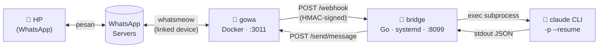

# claude-whatsapp

Jembatan WhatsApp ↔ [Claude Code](https://claude.com/claude-code): pesan WhatsApp masuk memicu satu panggilan `claude -p`, hasilnya dikirim balik sebagai balasan WhatsApp. Tidak ada proses interaktif yang harus dijaga hidup terus-menerus — setiap pesan ditangani sebagai satu request/response biasa, dengan kontinuitas percakapan dijaga lewat `claude --resume <session-id>`.

Dibangun di atas [gowa](https://github.com/aldinokemal/go-whatsapp-web-multidevice) (WhatsApp client unofficial, Go + [whatsmeow](https://github.com/tulir/whatsmeow)) sebagai lapisan koneksi WhatsApp, dan sebuah bridge Go kecil (repo ini) yang menjembataninya ke Claude Code CLI.



Dokumentasi arsitektur lengkap (komponen, sequence diagram, model keamanan, referensi API): **[`docs/ARCHITECTURE.md`](docs/ARCHITECTURE.md)**.

## Prinsip desain

Bridge ini sengaja dibuat sesederhana mungkin: **tidak ada proses interaktif yang harus dijaga hidup**. gowa memegang koneksi WhatsApp sebagai proses Docker yang berdiri sendiri (stabil, gampang di-restart lewat Docker), dan bridge cuma HTTP server headless biasa — tidak ada TTY, tidak ada prompt yang perlu dijawab, tidak ada sesi yang bisa "putus diam-diam" tanpa cara memperbaikinya dari luar. Tiap pesan WhatsApp = satu panggilan `claude -p` yang berdiri sendiri, `--resume` menjaga kontinuitas percakapannya. Restart bridge persis seperti restart service Linux pada umumnya — `systemd` biasa, tanpa langkah tambahan.

## Prasyarat

- Linux (dites di Raspberry Pi 5 / aarch64 Debian 13; harusnya jalan di distro Linux lain & x86_64 juga — gowa dan bridge sama-sama Go, tidak ada dependency spesifik-arsitektur)
- [Docker](https://docs.docker.com/engine/install/) + Docker Compose plugin
- [Go](https://go.dev/dl/) 1.26+
- [Claude Code CLI](https://docs.claude.com/claude-code) terpasang dan sudah login (`npm install -g @anthropic-ai/claude-code`, lalu `claude` sekali secara interaktif untuk login) — bridge memanggil binary `claude` yang sama ini
- Nomor WhatsApp yang bisa dijadikan *linked device* tambahan (nomor yang sudah Anda pakai sehari-hari, atau nomor khusus)
- `systemd --user` (untuk persistence) — hampir semua distro modern sudah punya ini bawaan

## Instalasi

### 1. Clone & siapkan `.env`

```bash
git clone https://github.com/<username>/claude-whatsapp.git
cd claude-whatsapp
cp .env.example .env
```

Edit `.env`:
- `WEBHOOK_SECRET` — generate sungguhan: `openssl rand -hex 32`
- `GOWA_BASIC_AUTH_USER` / `GOWA_BASIC_AUTH_PASSWORD` — ganti dari default
- `ALLOWED_SENDERS` — nomor HP **Anda sendiri** (pengirim), format `<kode negara><nomor>@s.whatsapp.net`, contoh `6281234567890@s.whatsapp.net`. **Bukan** nomor device bridge — gowa cuma mengirim webhook untuk pesan yang datang dari orang lain, jadi ini nomor yang akan Anda pakai untuk chat ke bridge-nya.
- `ALLOWED_GROUPS` (opsional) — JID grup (`...@g.us`) kalau mau bridge juga bisa dipakai di grup WhatsApp, pisah koma kalau lebih dari satu. Kosongkan untuk nonaktifkan akses grup sama sekali (DM saja). Sekali grup di-allowlist, semua anggotanya bisa memicu bridge — lihat `docs/ARCHITECTURE.md` §10 untuk detail & cara dapat JID grup.

Sisanya (`WORK_DIR`, `SESSION_STORE_PATH`, `CLAUDE_BIN`) punya default yang masuk akal (lihat komentar di `.env.example`) — biarkan saja kalau tidak ada kebutuhan khusus.

### 2. Jalankan gowa

```bash
docker compose up -d
docker logs claude-whatsapp-gowa --tail 20   # pastikan tidak ada error
```

Ini juga menjalankan `gowa-media-perms-fix`, sidecar kecil yang melonggarkan permission file lampiran (gowa menyimpannya `0600` milik user internal container, tidak bisa dibaca bridge tanpa ini — lihat [Troubleshooting](#troubleshooting)).

### 3. Build & pasang bridge sebagai service

```bash
scripts/deploy.sh
```

Idempotent — aman dijalankan ulang tiap kali ada perubahan kode (build ulang binary, regenerate unit systemd dengan path & `$PATH` mesin Anda saat ini, restart service).

### 4. Pairing device WhatsApp

API manajemen multi-device gowa (`/devices/{id}/login*`) belum stabil per image `:latest` saat ini — pakai endpoint legacy dengan `device_id` eksplisit:

```bash
source .env

# Buat device slot baru
DEVICE_ID=$(curl -s -u "$GOWA_BASIC_AUTH_USER:$GOWA_BASIC_AUTH_PASSWORD" \
  -X POST "http://localhost:${GOWA_PORT:-3011}/devices" -H "Content-Type: application/json" -d '{}' \
  | python3 -c 'import json,sys;print(json.load(sys.stdin)["results"]["id"])')
echo "device_id: $DEVICE_ID"

# Minta kode pairing (ganti <nomor> dengan nomor Anda, kode negara + nomor, tanpa +)
curl -s -u "$GOWA_BASIC_AUTH_USER:$GOWA_BASIC_AUTH_PASSWORD" \
  "http://localhost:${GOWA_PORT:-3011}/app/login-with-code?phone=<nomor>&device_id=$DEVICE_ID"
```

Response berisi `pair_code` (format `XXXX-XXXX`) — **langsung masukkan ke HP** (WhatsApp → Linked Devices → Link a Device → "Link with phone number instead") sebelum kedaluwarsa (~2-3 menit).

Field `state` di `/devices/{id}` bisa menunjukkan `"connected"` prematur (baru level koneksi WebSocket, belum tentu sudah login). Cek status sesungguhnya:

```bash
curl -s -u "$GOWA_BASIC_AUTH_USER:$GOWA_BASIC_AUTH_PASSWORD" \
  "http://localhost:${GOWA_PORT:-3011}/app/status?device_id=$DEVICE_ID"
# tunggu sampai "is_logged_in": true
```

Setelah login sekali, sesi tersimpan di volume `./data/whatsapp` — restart container/bridge tidak perlu pairing ulang.

### 5. Verifikasi

Kirim pesan WhatsApp apa saja ke nomor yang baru di-pairing dari nomor yang Anda daftarkan di `ALLOWED_SENDERS`. Kalau tidak ada balasan, lihat [Troubleshooting](#troubleshooting) di bawah.

### 6. (Opsional) Transkripsi voice note

```bash
scripts/setup-whisper.sh
scripts/deploy.sh   # restart service supaya perubahan ke-pick up
```

Build `whisper.cpp` dari source dan pasang model multilingual `base` ke `data/whisper/ggml-base.bin` (~150MB, sekali download). Butuh `cmake` dan `ffmpeg` — script akan berhenti dengan pesan jelas kalau salah satunya belum terpasang (`sudo apt-get install -y cmake ffmpeg`). Tanpa langkah ini, voice note tetap terkirim ke Claude tapi cuma sebagai instruksi "minta pengirim ketik ulang" — tidak ada yang rusak, fiturnya cuma nonaktif.

## Konfigurasi

Referensi env var lengkap ada di `.env.example` dan [`docs/ARCHITECTURE.md` §13](docs/ARCHITECTURE.md#13-konfigurasi-env-var). Dua yang wajib diisi (bridge menolak start kalau kosong): `WEBHOOK_SECRET`, `ALLOWED_SENDERS`.

## Troubleshooting

| Gejala | Kemungkinan penyebab | Cek |
|---|---|---|
| Tidak ada balasan sama sekali | `claude` tidak ketemu di `$PATH` milik service systemd | `journalctl --user -u claude-whatsapp.service -n 50` — cari `executable file not found` |
| Balasan generik "ada error di sisi saya" | `claude -p` gagal/timeout, atau kegagalan endpoint gowa lain (mis. format `action` presence salah) | Log yang sama di atas — pesan errornya spesifik |
| Webhook tidak pernah sampai ke bridge | Signature HMAC tidak cocok (`WEBHOOK_SECRET` beda antara `.env` bridge dan flag `--webhook-secret` container gowa), atau bridge belum jalan | `docker logs claude-whatsapp-gowa`, `curl localhost:8099/health` |
| Device gagal pairing / status `is_logged_in: false` terus | Cek ulang sesuai [§4](#4-pairing-device-whatsapp) — field `state` yang "connected" itu prematur, jangan percaya sebelum `is_logged_in: true` | `curl .../app/status?device_id=...` |
| `device login with code is not implemented yet` / `device login per ID is not implemented yet` | Endpoint device-manager baru (`/devices/{id}/login*`) belum matang di image gowa `:latest` | Pakai endpoint legacy (`/app/login-with-code?device_id=...`) seperti di [§4](#4-pairing-device-whatsapp), bukan `/devices/{id}/login*` |
| Kirim foto/dokumen, Claude bilang tidak bisa baca file (permission denied) | gowa menulis file lampiran sebagai `0600` milik user internal container (uid 20001) — bridge (user host) tidak punya akses baca | Pastikan `gowa-media-perms-fix` jalan: `docker ps \| grep media-perms-fix`. Kalau tidak ada, `docker compose up -d` lagi |

## Fitur

- **Teks** — dua arah, dengan kontinuitas sesi per chat.
- **Lampiran** — gambar, video, dokumen (PDF dkk — Claude baca langsung lewat tool Read-nya), dan stiker.
- **Voice note** — ditranskrip otomatis secara lokal (`whisper.cpp`, model multilingual, tanpa API cloud) sebelum dikirim ke `claude -p`. Opsional: kalau `scripts/setup-whisper.sh` belum pernah dijalankan, fitur ini nonaktif otomatis dan voice note fallback ke "minta pengirim ketik ulang". Dibenchmark di Raspberry Pi 5 (4 thread CPU): model `base` ~2.3x lebih cepat dari real-time, jadi voice note 30 detik selesai ditranskrip dalam hitungan detik.
- **Durability** — pesan ditulis ke antrian on-disk (`~/.claude-whatsapp/pending/`) sebelum di-ack ke gowa, dan direplay otomatis saat startup kalau bridge sempat mati di tengah proses (lihat `internal/pending`).
- **Satu `claude -p` per chat pada satu waktu** — dikunci per `chat_id` (`internal/webhook/chatlock.go`). Ditambahkan setelah kejadian nyata: restart bridge di tengah proses sempat me-replay 2 pesan chat yang sama secara bersamaan, keduanya rebutan sesi `--resume` yang sama dan macet berkepanjangan. Pesan lain untuk chat yang sama sekarang antre, bukan race.
- **Access control per-grup** — `ALLOWED_GROUPS` (terpisah dari `ALLOWED_SENDERS`) menentukan grup mana yang boleh chat ke bridge. Sekali grup di-allowlist, semua anggotanya bisa memicu bridge (bukan per-member — gowa tidak expose data @-mention di webhook, lihat `docs/ARCHITECTURE.md` §10).

## Belum diimplementasikan (v1)

- Mention-gating di grup (balas cuma kalau di-mention) — access control per-grup level grup sudah ada, level member/mention belum bisa dibangun (keterbatasan data dari gowa).
- Approval tool-call lewat reaction emoji.
- Rate limiting lintas-chat (banyak chat berbeda kirim pesan bersamaan tetap masing-masing jadi proses `claude -p` sendiri, tanpa batas jumlah proses paralel).

Kontribusi/PR untuk salah satu di atas dipersilakan.

## Struktur repo

```
claude-whatsapp/
├── cmd/bridge/main.go               # entrypoint
├── internal/
│   ├── config/                      # baca & validasi .env
│   ├── gowa/                        # REST client ke gowa
│   ├── webhook/                     # verifikasi HMAC, parsing lampiran, orkestrasi
│   ├── claude/                      # exec claude -p, parse JSON
│   ├── session/                     # chat_id -> session_id
│   ├── pending/                     # antrian durable — replay setelah crash
│   └── transcribe/                  # exec whisper-cli untuk voice note
├── docker-compose.yml                # gowa + sidecar perbaikan permission
├── deploy/claude-whatsapp.service.template
├── scripts/deploy.sh
├── scripts/setup-whisper.sh          # build whisper.cpp + download model (opsional)
└── docs/ARCHITECTURE.md              # dokumentasi arsitektur lengkap
```

## Status

Dipakai harian di satu instance (Raspberry Pi 5), belum pernah dites di lingkungan lain. Repo ini masih **private** sampai terbukti cukup matang untuk dipakai orang lain — kalau Anda membaca ini di repo public, berarti sudah lewat tahap itu. Issue dan PR welcome.
