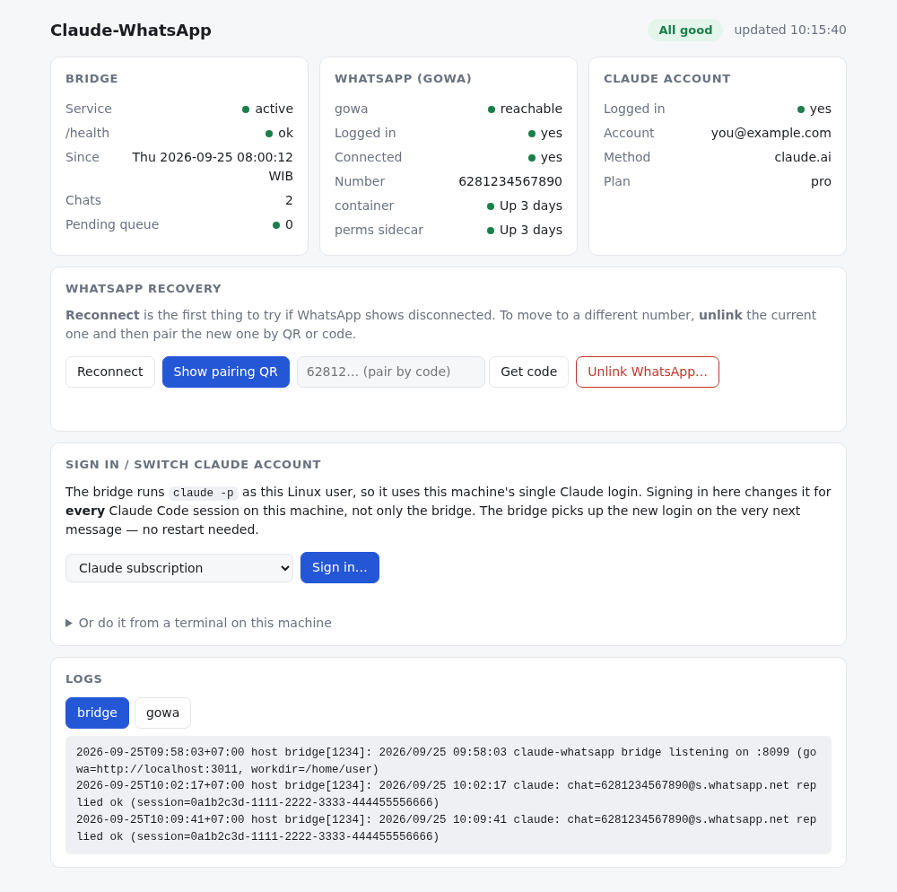
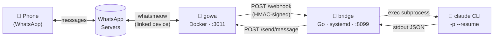
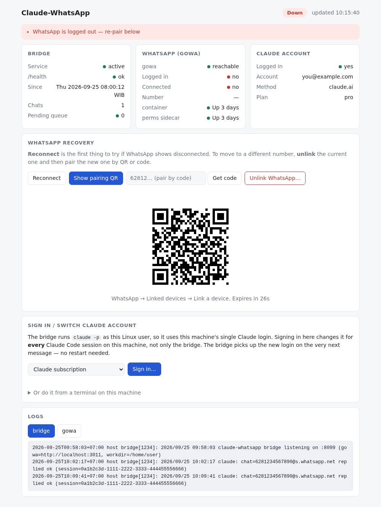
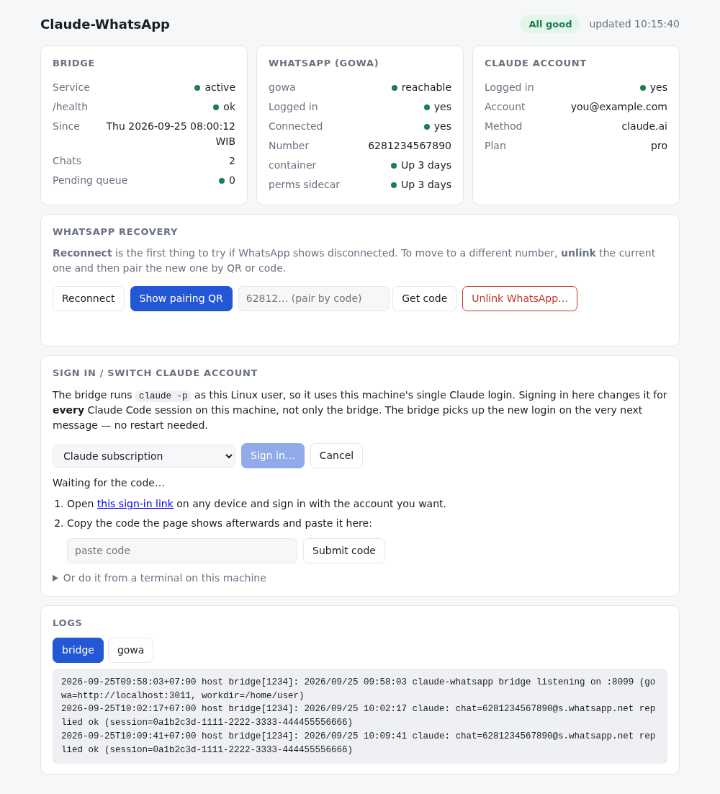

# claude-whatsapp

**English** · [Bahasa Indonesia](README.id.md)

Chat with [Claude Code](https://claude.com/claude-code) over WhatsApp. Each incoming message triggers one `claude -p` call on your own machine, and the result is sent back as a WhatsApp reply — attachments (images, documents) and voice notes included. Conversations continue per chat through `claude --resume`.



**Contents:** [How it works](#how-it-works) · [Read this first](#read-this-first-security) · [Quick start](#quick-start) · [Admin UI](#admin-ui) · [Configuration](#configuration) · [Upgrade & uninstall](#upgrade--uninstall) · [Manual install](#manual-install-from-source) · [Troubleshooting](#troubleshooting) · [Features](#features)

## How it works

Built on [gowa](https://github.com/aldinokemal/go-whatsapp-web-multidevice) (an unofficial WhatsApp client, Go + [whatsmeow](https://github.com/tulir/whatsmeow)), which holds the WhatsApp connection as a Docker container, plus a small Go bridge (this repo) that connects it to the Claude Code CLI.



It is deliberately as simple as possible: **no interactive process to keep alive**. gowa stands alone as a container (easy to restart), the bridge is a plain headless HTTP server (`systemd --user`, `Restart=always`), and every message is one self-contained `claude -p` call. Full details: [`docs/ARCHITECTURE.md`](docs/ARCHITECTURE.md).

Two WhatsApp numbers are involved:

| | Role | Where it is set |
|---|---|---|
| **Bot number** | The number that gets **linked** to gowa as a *linked device* — you send your messages to this number. Ideally a dedicated number, not your main one. | Pairing through the [Admin UI](#3-link-whatsapp) |
| **Sender number** | **Your** phone number, the one allowed to give commands to the bot. Messages from any other number are ignored. | `ALLOWED_SENDERS` in `.env` |

## Read this first (security)

- **This is not a sandbox.** `claude -p` runs as the Linux user that installed the bridge, with `--permission-mode auto`. Anyone in `ALLOWED_SENDERS` (or a member of a group in `ALLOWED_GROUPS`) can effectively make Claude read files and run commands on that machine — including `sudo` if that user has passwordless `sudo`. Only allow numbers you fully trust, and consider installing it under a separate unprivileged user or VM. Details in [`docs/ARCHITECTURE.md` §11](docs/ARCHITECTURE.md#11-security).
- **Unofficial WhatsApp client.** gowa/whatsmeow is not an official WhatsApp product; using it may go against WhatsApp's terms of service and can get an account restricted. Use at your own risk — preferably with a dedicated number.
- **Keep `.env` and `data/` private.** `.env` holds the webhook secret and the gowa password; `data/whatsapp/` is the live WhatsApp session (full access to the bot account). Both are in `.gitignore` — never commit or share them.
- **The Admin UI is for you only.** It can re-link WhatsApp and change the Claude login. By default it is reachable only from the machine itself; don't expose it to the internet. See [Admin UI](#admin-ui).

## Quick start

### 1. Prerequisites

- Linux with **systemd** (tested on a Raspberry Pi 5 / aarch64 Debian 13; also built for armv7 and x86_64)
- [Docker](https://docs.docker.com/engine/install/) with the Compose plugin, and your user in the `docker` group
- [Claude Code CLI](https://docs.claude.com/claude-code) installed and on your `PATH` (`npm install -g @anthropic-ai/claude-code`) — signing in can be done after installation, from the Admin UI
- A WhatsApp number to use as the bot, and a phone to scan its QR code

Go is **not** needed for this route.

### 2. Install

Run as a **regular user, not with `sudo`**:

```bash
curl -sSL https://raw.githubusercontent.com/tarkiman/claude-whatsapp/main/scripts/quick-install.sh | bash
```

The installer downloads a prebuilt release, asks for your **sender number** (your own phone number with country code and no leading 0, e.g. `6281234567890`), creates `.env` with random secrets, starts gowa with Docker Compose, and installs the bridge and admin services. Everything goes into `~/claude-whatsapp`.

<details>
<summary>Installer options</summary>

```bash
curl -sSL .../quick-install.sh | bash -s -- --allowed-senders 6281234567890 --non-interactive
```

| Option | Effect |
|---|---|
| `--allowed-senders <number[,number]>` | sender number(s), without the interactive prompt |
| `--dir <path>` | install location (default `~/claude-whatsapp`) |
| `--version <tag>` | install a specific version, e.g. `v0.1.0` (default: latest release) |
| `--gowa-port <port>` | gowa's host port (default `3011`) |
| `--skip-start` | only prepare `.env`; don't start Docker or the services |
| `--non-interactive` | never prompt |

</details>

### 3. Link WhatsApp

Open the Admin UI at **http://127.0.0.1:8098** (from another computer: [SSH tunnel](#access-from-another-computer)). In the **WhatsApp recovery** card click **Show pairing QR**, then on the bot's phone go to *WhatsApp → Linked devices → Link a device* and scan the QR. The QR is valid for 30 seconds; the page shows success by itself. If you prefer a code, enter the bot's number and click **Get code**.



### 4. Sign in to Claude

In the **Sign in / switch Claude account** card click **Sign in…**, open the link that appears (on any device), sign in with your Claude account, then paste the code shown on that page into the "paste code" field and click **Submit code**. If the **Claude account** card at the top already says `Logged in: yes`, skip this step.



This login is shared by **every** Claude Code session of that Linux user, not just the bridge; the bridge uses a new login from the very next message, no restart needed. Alternative from a terminal: `claude auth login`.

### 5. Try it

From the sender number, send any WhatsApp message to the bot number. The overall status in the Admin UI should read **All good**. If nothing comes back, see [Troubleshooting](#troubleshooting).

## Admin UI

A status and recovery page at `http://127.0.0.1:8098`, run as its own service (`claude-whatsapp-admin`) so it stays reachable precisely when the bridge is the thing that is broken.

- **Status** — bridge, gowa and Claude account on one screen, with an **All good / Degraded / Down** indicator and the reasons, plus bridge and gowa logs.
- **WhatsApp recovery** — Reconnect (try this first when status says disconnected), pairing by QR, pairing by code, and **Unlink** to move to a different bot number.
- **Sign in / switch Claude account** — sign in or change accounts without opening a terminal.

`Down` + "WhatsApp is logged out" means the WhatsApp session was deleted (for example the device was unlinked from the phone, or the main phone was offline for too long). The bot answers nothing until it is linked again — and no other alarm goes off, so check this page from time to time.

### Access from another computer

By default the page **listens on `127.0.0.1` only**. From a laptop or phone, use an SSH tunnel:

```bash
ssh -L 8098:127.0.0.1:8098 <user>@<bot-machine-ip>     # then open http://localhost:8098
```

Or serve it directly on your LAN / [ZeroTier](https://www.zerotier.com/) by setting this in `.env` (then `systemctl --user restart claude-whatsapp-admin`):

```bash
ADMIN_ADDR=127.0.0.1:8098,192.168.1.20:8098,10.147.20.15:8098   # this machine's specific IPs; 0.0.0.0 is refused
ADMIN_ALLOWED_NETS=192.168.1.0/24,10.147.0.0/16                  # only clients from these networks are served
ADMIN_PASSWORD=<long-random-string>                              # optional but strongly recommended
```

Clients outside `ADMIN_ALLOWED_NETS` are rejected right away (403), and an IP that doesn't exist yet at boot (e.g. a ZeroTier interface) is retried every 5 seconds. This is plain HTTP: a network restriction alone doesn't protect you from other users on the same network, so set `ADMIN_PASSWORD` if you don't fully trust the network, and never expose the page to the public internet.

## Configuration

Everything lives in `.env` in the install directory (`chmod 600`; fully commented template: [`.env.example`](.env.example), reference table: [`docs/ARCHITECTURE.md` §13](docs/ARCHITECTURE.md#13-configuration-env-vars)). The installer fills in what is required; the rest has sensible defaults.

| Variable | Purpose |
|---|---|
| `ALLOWED_SENDERS` | **Required.** Sender numbers allowed to give commands (JIDs like `6281…@s.whatsapp.net`, comma-separated). The bridge refuses to start if empty. |
| `ALLOWED_GROUPS` | Optional. Group JIDs (`…@g.us`) allowed to use the bot; empty = DMs only. Once a group is listed, **every** member can trigger the bot. |
| `WEBHOOK_SECRET` | HMAC key between gowa and the bridge — generated randomly by the installer. |
| `GOWA_BASIC_AUTH_USER/PASSWORD` | Credentials for gowa's REST API — the password is generated randomly by the installer. |
| `WORK_DIR` | Working directory of `claude -p` (default `$HOME`; this is where your `CLAUDE.md` is picked up). |
| `ADMIN_ADDR`, `ADMIN_ALLOWED_NETS`, `ADMIN_PASSWORD` | Admin UI access — see [above](#access-from-another-computer). |

To change `.env`: edit it, then `systemctl --user restart claude-whatsapp.service claude-whatsapp-admin.service` (plus `docker compose up -d` in the install directory if you changed anything gowa-related).

## Upgrade & uninstall

**Upgrade** — run the same install command again. Binaries and scripts are replaced; `.env` and `data/` (the WhatsApp session) are left alone. Avoid upgrading during an active conversation: the restart kills any running `claude -p`.

**Uninstall:**

```bash
systemctl --user disable --now claude-whatsapp.service claude-whatsapp-admin.service
rm ~/.config/systemd/user/claude-whatsapp.service ~/.config/systemd/user/claude-whatsapp-admin.service
systemctl --user daemon-reload
cd ~/claude-whatsapp && docker compose down
sudo rm -rf ~/claude-whatsapp ~/.claude-whatsapp   # sudo: files in data/ are owned by the user inside the container
```

Then remove the bot device from the phone (*Linked devices* → pick the device → *Log out*) so the session is really revoked.

## Manual install (from source)

For development, or if you'd rather not use the installer. Additionally requires [Go](https://go.dev/dl/) 1.26+.

```bash
git clone https://github.com/tarkiman/claude-whatsapp.git && cd claude-whatsapp
cp .env.example .env && chmod 600 .env
```

Edit `.env`: set `WEBHOOK_SECRET` (`openssl rand -hex 32`), change `GOWA_BASIC_AUTH_PASSWORD` (in **both** places it appears), and set `ALLOWED_SENDERS` to your sender number (`6281234567890@s.whatsapp.net`). Then:

```bash
docker compose up -d      # gowa + the attachment-permission sidecar
scripts/deploy.sh         # build bridge + admin, install the systemd --user services (idempotent)
```

Continue with [steps 3 and 4](#3-link-whatsapp) above. `scripts/deploy.sh` is safe to re-run after any code change (rebuilds, regenerates the units with this machine's paths and `$PATH`, restarts explicitly).

<details>
<summary>Pairing WhatsApp without the Admin UI (curl)</summary>

gowa's newer multi-device API (`/devices/{id}/login*`) isn't stable in the current `:latest` image — use the legacy endpoints with an explicit `device_id`:

```bash
source .env
DEVICE_ID=$(curl -s -u "$GOWA_BASIC_AUTH_USER:$GOWA_BASIC_AUTH_PASSWORD" \
  -X POST "http://localhost:${GOWA_PORT:-3011}/devices" -H "Content-Type: application/json" -d '{}' \
  | python3 -c 'import json,sys;print(json.load(sys.stdin)["results"]["id"])')

# replace <number> with the bot's number (country code + number, no +)
curl -s -u "$GOWA_BASIC_AUTH_USER:$GOWA_BASIC_AUTH_PASSWORD" \
  "http://localhost:${GOWA_PORT:-3011}/app/login-with-code?phone=<number>&device_id=$DEVICE_ID"

# wait for "is_logged_in": true (the "state" field on /devices can say "connected" prematurely)
curl -s -u "$GOWA_BASIC_AUTH_USER:$GOWA_BASIC_AUTH_PASSWORD" \
  "http://localhost:${GOWA_PORT:-3011}/app/status?device_id=$DEVICE_ID"
```

Enter the `pair_code` (`XXXX-XXXX`) on the phone right away (*Link a device → Link with phone number instead*) before it expires (~2–3 minutes). The session is stored in `./data/whatsapp`, so restarts don't need re-pairing.

</details>

<details>
<summary>Voice-note transcription (optional)</summary>

```bash
scripts/setup-whisper.sh
```

Builds `whisper.cpp` from source and installs the multilingual `base` model to `data/whisper/ggml-base.bin` (~150 MB, one-time download). Needs `cmake` and `ffmpeg`. Without this step voice notes still reach Claude, only as a "ask the sender to type it out" instruction — the feature just switches itself off, nothing breaks.

</details>

## Troubleshooting

Start with the [Admin UI](#admin-ui): the status, the reasons and the logs usually point straight at the problem.

| Symptom | Likely cause | Check |
|---|---|---|
| Bot silent although the service is `active` | WhatsApp session deleted/unlinked (Admin UI: `Down` + "logged out"), or gowa lost its connection | Admin UI → **Reconnect**, or pair again. `docker logs claude-whatsapp-gowa` |
| No reply at all | `claude` not found on the systemd service's `$PATH`, or not signed in | `journalctl --user -u claude-whatsapp.service -n 50` — look for `executable file not found`; check the **Claude account** card |
| Generic "there was an error on my side" reply | `claude -p` failed/timed out, or another gowa endpoint failed | Same log — the error message is specific |
| Bridge log says "replied ok" but the message never arrives | "replied ok" only means gowa's API answered 2xx, not that WhatsApp sent it — usually gowa is disconnected | Admin UI: `Connected: no` → **Reconnect** |
| Webhook never reaches the bridge | HMAC signature mismatch (`WEBHOOK_SECRET` differs between `.env` and the gowa container), or the bridge isn't running | `docker logs claude-whatsapp-gowa`, `curl localhost:8099/health` |
| Pairing fails / `is_logged_in: false` forever | The "connected" `state` field is premature — only `is_logged_in: true` can be trusted | `curl .../app/status?device_id=...` |
| `… is not implemented yet` | gowa's newer device-manager endpoints (`/devices/{id}/login*`) aren't mature in `:latest` | Use the Admin UI or the legacy endpoints (`/app/login*?device_id=`) |
| Sent a photo/document, Claude says it can't read the file (permission denied) | gowa stores attachments as `0600` owned by the container's internal user | Make sure the sidecar is running: `docker ps \| grep media-perms-fix`; if missing, `docker compose up -d` |
| Installer: "could not find a release" | No release for your architecture yet, or GitHub is unreachable | Install manually (above) |

## Features

- **Text** — both directions, with per-chat session continuity.
- **Attachments** — images, video, documents (PDFs etc. — Claude reads them directly with its Read tool) and stickers.
- **Voice notes** — transcribed locally (`whisper.cpp`, multilingual, no cloud API) before being sent to `claude -p`. Optional. On a Raspberry Pi 5 (4 CPU threads) the `base` model runs ~2.3x faster than real time.
- **Durability** — messages are written to an on-disk queue (`~/.claude-whatsapp/pending/`) before being acked to gowa and replayed automatically if the bridge died mid-flight.
- **One `claude -p` per chat at a time** — locked per `chat_id`; further messages for the same chat queue instead of fighting over the same `--resume` session.
- **Per-group access control** — `ALLOWED_GROUPS` is separate from `ALLOWED_SENDERS`. Once a group is listed, every member can trigger the bot (gowa's webhook carries no @-mention data, see [`docs/ARCHITECTURE.md` §10](docs/ARCHITECTURE.md#10-per-group-access-control)).
- **Admin UI** — status, WhatsApp recovery and Claude sign-in ([above](#admin-ui)).

**Not implemented yet:** mention-gating in groups (a data limitation from gowa), tool-call approval via emoji reaction, and cross-chat rate limiting (every different chat is its own `claude -p` process, with no cap on how many run in parallel). Contributions and PRs welcome.

## Repository layout

```
claude-whatsapp/
├── cmd/bridge/main.go               # bridge entrypoint
├── cmd/admin/main.go                # Admin UI entrypoint
├── internal/
│   ├── admin/                       # Admin UI handlers + web/index.html (embedded)
│   ├── config/                      # read & validate .env
│   ├── gowa/                        # REST client for gowa
│   ├── webhook/                     # HMAC verification, attachment parsing, orchestration
│   ├── claude/                      # exec claude -p, parse JSON
│   ├── session/                     # chat_id -> session_id
│   ├── pending/                     # durable queue — replayed after a crash
│   └── transcribe/                  # exec whisper-cli for voice notes
├── docker-compose.yml               # gowa + permission-fix sidecar
├── deploy/                          # systemd unit templates (bridge, admin)
├── scripts/
│   ├── quick-install.sh             # one-line installer (curl | bash)
│   ├── install.sh                   # .env + gowa (Docker) + systemd services
│   ├── deploy.sh                    # build (if Go + source present) / use bin/ + install services
│   ├── package-release.sh           # cross-compile + one tarball per architecture
│   └── setup-whisper.sh             # whisper.cpp + model (optional)
├── .github/workflows/release.yml    # tag v* -> publish arm64/armv7/amd64 tarballs
└── docs/                            # ARCHITECTURE.md (+ .id.md), images/
```

**Releasing:** `git tag v0.x.0 && git push origin v0.x.0` — the workflow runs the tests, then publishes the tarballs that `quick-install.sh` downloads.

## License

[MIT](LICENSE). The software is provided as is, without warranty of any kind — see also the [security notes](#read-this-first-security).
