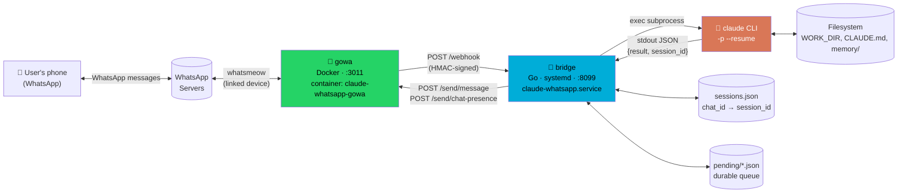
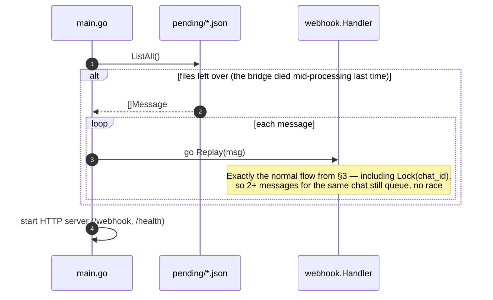
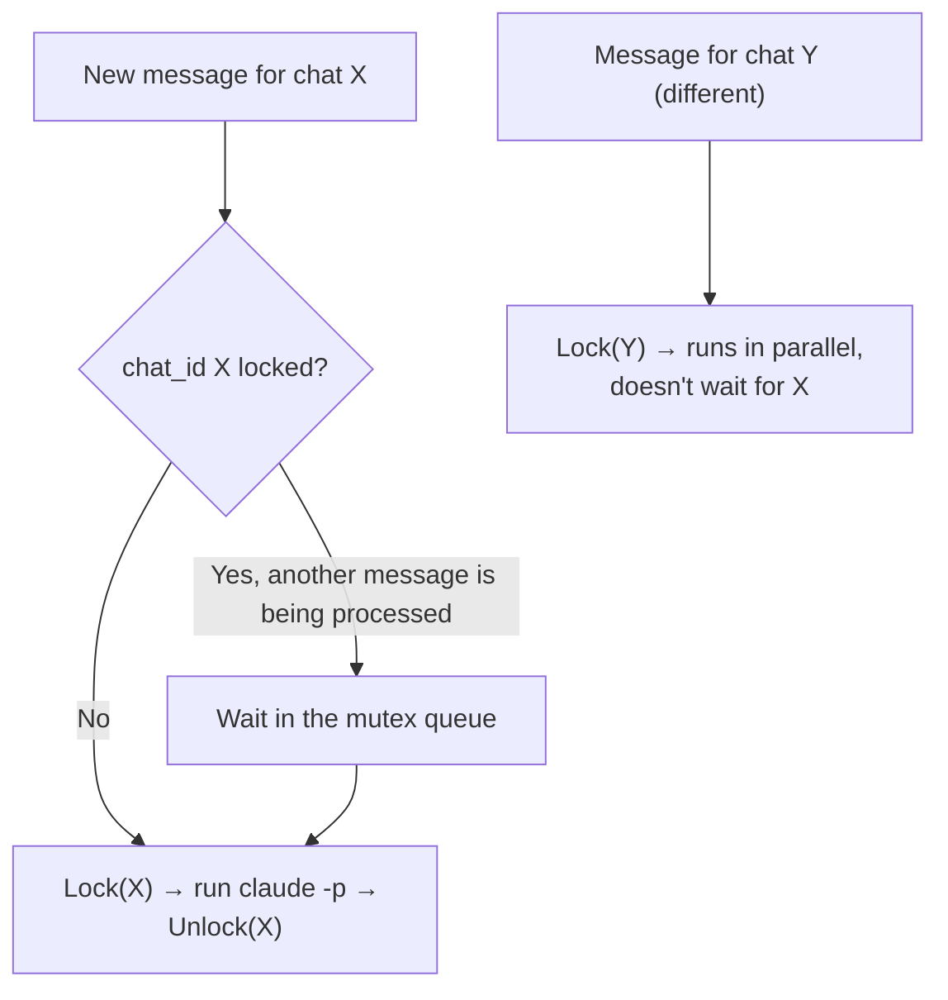

# `claude-whatsapp` architecture

**English** · [Bahasa Indonesia](ARCHITECTURE.id.md)

This document is the complete technical reference: components, data flow, sequence diagrams, the security model and design decisions — for anyone (including a future Claude Code session) who needs to understand the system without re-reading its whole development history.

## 1. Overview

`claude-whatsapp` connects WhatsApp to Claude Code: an incoming WhatsApp message triggers one `claude -p` call, and the result is sent back as a WhatsApp reply. There is no interactive process to keep alive — every message is handled as a single request/response, with conversation continuity maintained through `--resume <session-id>`.

Built on 2026-08-28 and developed and used day to day on a Raspberry Pi 5.

## 2. Components

| Component | Technology | Role |
|---|---|---|
| **gowa** | Go + [whatsmeow](https://github.com/tulir/whatsmeow), Docker | Holds the actual WhatsApp connection (linked device). Fires a webhook when a message arrives, accepts send-message commands over its REST API. |
| **gowa-media-perms-fix** | Alpine, Docker sidecar | Loosens permissions on attachment files that gowa auto-downloads (written `0600` and owned by the container's uid, unreadable by the bridge without this) — see [§7](#7-media-attachments). |
| **bridge** | Go (custom, this repo) | Headless HTTP server. Receives webhooks from gowa, runs `claude -p`, sends the reply through gowa's REST API. |
| **claude CLI** | `@anthropic-ai/claude-code` (npm) | The actual brain — one subprocess call per message, print mode (`-p`), resumed per `chat_id`. |
| **sessions.json** | Local JSON file | Map of `chat_id → claude session_id`, so the next `claude -p` call for the same chat uses `--resume`. |
| **pending/*.json** | Local JSON files | Durable queue — one file per message that was acked to gowa but not yet answered. See [§8](#8-message-durability). |



## 3. Sequence diagram — one message cycle

```mermaid
sequenceDiagram
    autonumber
    actor U as User<br/>(WhatsApp)
    participant W as WhatsApp<br/>Servers
    participant G as gowa<br/>(Docker)
    participant B as bridge<br/>(Go)
    participant C as claude CLI
    participant P as pending/*.json
    participant S as sessions.json

    U->>W: Send message (text/media)
    W->>G: Deliver (whatsmeow)
    G->>B: POST /webhook<br/>event=message, HMAC in X-Hub-Signature-256 header
    activate B
    B->>B: Verify HMAC · filter (is_from_me, allowlist)
    B->>B: buildPrompt() — combine body/caption +<br/>attachment instructions if any (see §7)
    B->>P: Write(message_id, prompt, ...)
    Note over P: Written BEFORE the ack — if the bridge dies<br/>right after the ack, this is the evidence to replay
    B-->>G: 200 OK (ack, must be <10s)
    deactivate B
    Note over B: The rest runs async<br/>(goroutine separate from the HTTP response)

    B->>B: Lock(chat_id) — wait for our turn if another<br/>message for this chat is being processed (see §9)
    B->>G: POST /send/chat-presence<br/>{action: "start"}
    G->>W: Show "typing…"

    B->>S: Get(chat_id)
    S-->>B: prevSessionID (or empty)

    B->>C: exec claude -p "<prompt>"<br/>--resume <prevSessionID><br/>--permission-mode auto<br/>cwd=$HOME
    activate C
    Note over C: Reads ~/CLAUDE.md → for attachments,<br/>Reads the file directly; if asked to work in a<br/>specific repo, cd + read that repo's memory
    C-->>B: JSON {result, session_id, is_error}
    deactivate C

    alt is_error or exec failed, AND there is a prevSessionID
        B->>C: Retry: exec claude -p "<prompt>" (without --resume)
        C-->>B: JSON {result, session_id}
    end

    B->>S: Set(chat_id, new session_id)
    B->>G: POST /send/chat-presence<br/>{action: "stop"}
    B->>G: POST /send/message<br/>{phone: chat_id, message: result}
    G->>W: Send reply
    W->>U: Receive reply
    B->>P: Done(message_id) — delete, answered
    B->>B: Unlock(chat_id) — next message's turn
```

## 4. Startup — replaying pending messages



## 5. Code layout

```
claude-whatsapp/
├── cmd/bridge/main.go          # entrypoint: wires components, replays pending on startup, HTTP server
├── cmd/admin/main.go           # Admin UI entrypoint — see §16
├── internal/
│   ├── config/config.go        # read .env, validate (ALLOWED_SENDERS & WEBHOOK_SECRET required)
│   ├── gowa/client.go          # thin REST client for gowa (SendMessage, SetChatPresence, React)
│   ├── gowa/admin.go           # device operations for the Admin UI (status, QR, pair code, logout)
│   ├── admin/                  # Admin UI: handlers, network guard, Claude login, web/index.html — §16
│   ├── webhook/
│   │   ├── handler.go          # HMAC verification, filtering, orchestration of one message cycle
│   │   ├── media.go            # polymorphic attachment field parsing + buildPrompt()
│   │   └── chatlock.go         # per-chat_id lock — see §9
│   ├── claude/runner.go        # exec `claude -p`, parse JSON, retry without --resume on failure
│   ├── session/store.go        # chat_id → session_id, persisted to JSON, thread-safe (mutex)
│   ├── pending/store.go        # durable queue, thread-safe via atomic rename
│   └── transcribe/whisper.go   # exec whisper-cli for voice-note transcription — see §7.1
├── docker-compose.yml          # gowa + gowa-media-perms-fix sidecar
├── deploy/*.service.template   # systemd --user units for bridge & admin (path/PATH placeholders)
├── scripts/quick-install.sh    # one-line installer — see §16
├── scripts/install.sh          # .env + gowa + services
├── scripts/package-release.sh  # cross-compile + release tarballs
├── scripts/deploy.sh           # build/use bin/ + generate units from templates + install, idempotent
├── scripts/setup-whisper.sh    # build whisper.cpp + download model (optional)
└── .env.example                # every env var, documented
```

Import flow: `main.go` → `webhook.Handler` → (`gowa.Client`, `claude.Runner`, `session.Store`, `pending.Store`, `transcribe.Transcriber`). There are no cyclic dependencies; every `internal/*` package stands on its own.

## 6. Session continuity model

Every WhatsApp `chat_id` has one Claude Code conversation "thread" that keeps being resumed:

1. First message from a chat → `claude -p "<prompt>"` without `--resume` → Claude creates a new session, and the `session_id` comes back in the JSON output.
2. The `session_id` is stored in `sessions.json` keyed by `chat_id`.
3. Next message from the same chat → `claude -p "<prompt>" --resume <session_id>` → Claude continues exactly the same conversation as an ordinary interactive session (history, memory already read, etc. all stay in context).
4. If `--resume` fails (the session no longer exists/expired) → the bridge automatically retries ONCE without `--resume` so the chat doesn't get stuck — the user doesn't need to know this happened, they only lose the old history.

This means the bridge itself is **stateless** with respect to conversation content — all "memory" lives in the Claude Code session (managed by the `claude` CLI itself) and in per-repo memory (`~/.claude/projects/*/memory/`, see `~/CLAUDE.md`). If the `bridge` process restarts, no conversation is lost — `sessions.json` is still there, just keep resuming.

**Important**: `claude -p --resume <id>` is not designed to be accessed by several processes at once on the same `session_id` — see [§9](#9-per-chat-locking-concurrency) for why this matters and how the bridge guarantees only one active process per chat.

## 7. Media attachments

Images, video, documents and stickers are handled. Voice notes are transcribed locally with `whisper.cpp` (see §7.1) when set up; if not, they fall back to the "ask the sender to type it out" prompt as before.

**How it works:**
1. gowa (with `WHATSAPP_AUTO_DOWNLOAD_MEDIA=true`, its own default) downloads the attachment to `/app/statics/media/...` inside the container, and the webhook payload then carries that relative path (a plain string with no caption, or an object `{path, caption}` if there is one — see `internal/webhook/media.go`, `mediaRef.UnmarshalJSON` handles both).
2. `docker-compose.yml` mounts `./data/statics:/app/statics`, so that path also exists on the host — `resolveMediaPath()` translates it to an absolute path via `GOWA_MEDIA_DIR` (default `./data/statics`, relative to the bridge's working directory).
3. **A gotcha that cost a lot of debugging time**: gowa's entrypoint `chown`s that media folder to the container's internal uid (20001) and writes files with mode `0600` — the host user running the bridge (a different uid) cannot read those files at all without an extra fix. The fix: the `gowa-media-perms-fix` sidecar (image `alpine:3.19`, `restart: unless-stopped`), which loops `chmod -R o+rX /data/statics` on the same volume — it runs as root (the default for a plain container), so it can `chmod` files it doesn't own. If attachments fail to read again, first check that this sidecar is really running (`docker ps`).
4. `buildPrompt()` combines the caption (if any) with an explicit instruction containing the absolute path, for an image for example: `"[Image attachment: /path/to/file.jpg — read this file to see its contents before replying]"`. There is no separate multimodal API in print mode (`-p`) — Claude "sees" the image through its own Read tool, triggered by this text instruction.
5. For voice notes: see §7.1 — if transcription is available and succeeds, the text goes in as `"[Voice note transcript]: <text>"`; if not, it falls back to the old prompt asking the sender to type it out.

**Verified**: tested end-to-end on 2026-08-29 with a real photo over WhatsApp, including confirming that the permission-fix sidecar works automatically without manual intervention from the second attempt on.

### 7.1 Voice-note transcription (`internal/transcribe`)

Entirely local — `whisper.cpp` (CPU, no GPU) + a multilingual model, no cloud API or per-minute cost. Benchmarked directly on the target Raspberry Pi 5 (Cortex-A76, 4 threads, 11-second test audio):

| Model | Size | Processing time | Real-time factor |
|---|---|---|---|
| tiny | 77MB | 1.8 s | ~6x faster |
| base (default) | 147MB | 4.8 s | ~2.3x faster |
| small | 488MB | 16.1 s | ~1.5x slower |

`base` was chosen as the default — the best accuracy/speed balance for short voice notes (WhatsApp voice notes rarely exceed 1 minute).

**How it works:**
1. `handleMessage()` (async goroutine, not `ServeHTTP`) calls `transcribe.Transcriber.Transcribe()` — deliberately **not** on the synchronous webhook path, because gowa only allows ~10 seconds for the ack and transcription (especially with the `small` model) can take longer than that.
2. The audio is first normalized through `ffmpeg` to 16kHz mono PCM WAV — WhatsApp voice notes arrive as Opus-in-Ogg, and whisper.cpp's bundled decoder (miniaudio) is only reliable for Ogg-Vorbis, not Opus.
3. `whisper-cli -nt -np` is invoked for clean text output without timestamps or extra logging.
4. `webhook.FinalizeAudioPrompt()` combines the caption (if any) with the transcript, or falls back to the old prompt if the `Transcriber` is nil (not set up) or transcription failed for that file.

**Setup** (optional, see the README's voice-note section): `scripts/setup-whisper.sh` builds `whisper.cpp` from source and downloads the model to `bin/whisper-cli` + `data/whisper/ggml-base.bin`. `newTranscriber()` in `cmd/bridge/main.go` checks that both files exist at startup — if not, transcription switches itself off without making the bridge fail to start (an optional feature, not a hard dependency).

**Verified**: tested on 2026-08-29 — the benchmark of the three model sizes above was run directly on the Pi 5, and the transcripts were accurate (tested with whisper.cpp's bundled English sample audio); the code implementation was verified to build cleanly (`go build`, `go vet`).

## 8. Message durability

The problem this fixes: the webhook handler must ack gowa within <10 seconds, so the real work (calling `claude -p`, sending the reply) runs in a separate goroutine, async from the HTTP response. If the bridge process dies exactly between the ack and that goroutine finishing, gowa will not retry (it already got its 200) — the message could vanish without a trace.

**The solution** (`internal/pending`): every message that passes the filters is written to `~/.claude-whatsapp/pending/<message_id>.json` (the file name comes from `message_id`, so it is idempotent if there is a redelivery) **before** being acked, and is only deleted (`Done()`) once the reply — success or the fallback error message — has really been sent. If `SendMessage` itself fails (not an error from Claude, but a failure to send the reply), the pending file is deliberately **not** deleted, so the next restart tries again.

At startup, `main.go` calls `pending.Store.ListAll()` and replays every leftover file through `webhook.Handler.Replay()` — exactly the normal flow, just entering from `main.go` instead of `ServeHTTP`. See the diagram in [§4](#4-startup--replaying-pending-messages).

**Verified**: tested by injecting a fabricated pending file and restarting the service — the log shows `pending: found 1 message(s)... replaying`, the message was answered, and the file was deleted automatically.

## 9. Per-chat locking (concurrency)

**A problem found live on 2026-08-29**: while the bridge was being used to implement the whisper.cpp feature (§7.1), `scripts/deploy.sh` was run several times mid-work — each restart killed the `claude -p` process that was running, and then [§4](#4-startup--replaying-pending-messages) replayed the unanswered messages. Because `replayPending()` in `main.go` dispatches **all** pending messages at once (`go handler.Replay(m)` per message, without waiting for each other), two messages for the same chat were replayed **simultaneously** — both ran `claude -p --resume <the same session_id>` at the same time. The result: one trivial message ("ok, go") got stuck for minutes with no reply, and every following restart repeated the same problem (replay again, race again).

**The solution** (`internal/webhook/chatlock.go`): `chatLocks`, a `chat_id → *sync.Mutex` map created on demand. `handleMessage()` — called both from the normal flow (`ServeHTTP`) and from replay — locks the `chat_id` at the start and releases it via `defer` at the end. Different chats still run fully in parallel (a per-key mutex, not one global lock); a second message for the **same** chat simply waits its turn instead of racing.



**Verified**: a unit test (`internal/webhook/chatlock_test.go`) proves 20 goroutines for the same `chat_id` never have more than 1 active at once, and 2 different `chat_id`s don't block each other. In production: 5 consecutive messages to the same chat after the fix was deployed all completed in order without hanging (`journalctl` shows 5 consecutive `replied ok`, not a hang).

Note that `go test -race` does not work on this Pi 5 (`ThreadSanitizer: unsupported VMA range` — an ARM64 kernel limitation, not a code bug); the tests remain valid when run without `-race`.

## 10. Per-group access control

`config.IsAllowed(chatID, from)` gates DMs and groups **separately**:

- **DM** (`chat_id` ending in `@s.whatsapp.net`): processed if `from` OR `chat_id` is in `ALLOWED_SENDERS` — same as before.
- **Group** (`chat_id` ending in `@g.us`): processed if `chat_id` is in `ALLOWED_GROUPS` — **`ALLOWED_SENDERS` is irrelevant** for groups. Once a group is allowlisted, **any member of that group** can trigger the bridge, not just the numbers in `ALLOWED_SENDERS`.

**Why it is designed this way (not per-member inside a group):** gowa's webhook payload for group messages carries no mentioned-JID data (there is no `payload.mentions` or similar — checked directly against gowa's source, not assumed). Without it, the bridge has no way to tell "the bot was mentioned" from "an ordinary message in the group", so there is no technical basis for mention-gating. Access control therefore sits at the group level: the decision "may this group use the bridge" is in your hands when you fill in `ALLOWED_GROUPS`, not in the bridge's hands at runtime.

**Practical consequence**: if you want it stricter than "every member of group X is allowed", the only way today is to limit which groups are allowlisted (small/trusted groups), not who is inside them.

**How to get a group's JID**: `GET /user/my/groups` on gowa's REST API, or look at the `chat_id` field on a webhook message that already came in from that group.

**Verified**: `internal/config/config_test.go` — DMs allowed/denied according to `ALLOWED_SENDERS`, groups allowed/denied according to `ALLOWED_GROUPS` independently of `ALLOWED_SENDERS` (including the case: a number in `ALLOWED_SENDERS` does NOT automatically get into a group that isn't allowlisted).

## 11. Security

- **HMAC signature**: every webhook from gowa is signed with `HMAC-SHA256` using `WEBHOOK_SECRET` (header `X-Hub-Signature-256: sha256=<hex>`). The bridge rejects (`401`) requests whose signature doesn't match — see `webhook.Handler.validSignature`.
- **Sender allowlist**: `ALLOWED_SENDERS` (env var, required — the bridge refuses to start if empty) limits whose messages are processed. This is the **sender's** phone number (`payload.from`), not the bridge's own device number.
- **Basic auth to gowa**: the bridge authenticates to gowa's REST API with the same `GOWA_BASIC_AUTH_USER/PASSWORD` that is set on gowa through the `--basic-auth` flag.
- **Claude permissions**: the `claude -p` subprocess runs with `--permission-mode auto` (Claude Code's built-in permission classifier, not `--dangerously-skip-permissions`) — risky tool calls still need approval/are blocked according to the same auto-mode policy as an ordinary interactive session.
- **Admin UI**: by default only `127.0.0.1`. Binding to another address requires naming a specific IP (`0.0.0.0` is refused) and `ADMIN_ALLOWED_NETS`; client IPs outside that list are rejected before the request is processed. Optional `ADMIN_PASSWORD` (basic auth). The `Host` header is validated (anti DNS-rebinding), POSTs must carry an `X-Admin-Request` header and a matching `Origin` (anti-CSRF), and the QR image proxy is restricted to gowa's QR directory. The OAuth code pasted during Claude sign-in is not stored and is redacted from output. See §16.
- **Secrets**: `.env` (holding `WEBHOOK_SECRET` and the gowa password) is in `.gitignore` and never enters git. `.env.example` is placeholders only.
- **Not a sandbox**: the `claude -p` process runs as the ordinary Linux user that runs the bridge — its filesystem/command access is exactly what that user has on that machine. If that user has passwordless `sudo` (common in single-user setups such as a personal Raspberry Pi), Claude triggered through WhatsApp can also run `sudo` — and this **actually happened** while implementing §7.1 (`apt-get install cmake`, `mkdir`/`chown` for `data/whisper/`, all via passwordless `sudo`, triggered from a WhatsApp message). `--permission-mode auto` is a heuristic safety net (Claude Code's built-in classifier), **not** a formal security boundary like an isolated container — consider this before giving the bridge access to an account with broad privileges.

## 12. Not implemented yet

- Mention-gating in groups (reply only when mentioned) — can't be built right now, gowa doesn't expose mention data in the webhook (see [§10](#10-per-group-access-control)). Per-group access control itself **exists**, at group level rather than member level.
- Tool-call approval via emoji reaction — before a risky tool call (e.g. `sudo`), Claude stops and asks for a 👍/👎 confirmation on WhatsApp. The researched design direction: Claude Code's `PreToolUse` hooks (they can block a tool call and also run in `-p` mode) — not implemented yet, its stdin/stdout protocol needs to be tested empirically first.
- Cross-chat rate limiting — the per-chat lock ([§9](#9-per-chat-locking-concurrency)) prevents races within the same chat, but there is no cap yet on the number of parallel `claude -p` processes across many different chats at once.

## 13. Configuration (env vars)

| Variable | Used by | Default | Description |
|---|---|---|---|
| `LISTEN_ADDR` | bridge | `:8099` | Bridge HTTP server address (receives webhooks) |
| `GOWA_BASE_URL` | bridge | `http://localhost:3011` | gowa REST API endpoint |
| `GOWA_BASIC_AUTH_USER/PASSWORD` | bridge, gowa | — | Basic-auth credentials for gowa's REST API |
| `WEBHOOK_SECRET` | bridge, gowa | — (**required**) | HMAC key, must be identical on both sides |
| `ALLOWED_SENDERS` | bridge | — (**required**) | JIDs/numbers, comma-separated, allowed to DM ([§10](#10-per-group-access-control)) |
| `ALLOWED_GROUPS` | bridge | (empty = groups disabled) | Group JIDs (`...@g.us`), comma-separated, allowed to chat ([§10](#10-per-group-access-control)) |
| `CLAUDE_BIN` | bridge | `claude` | Path to the `claude` CLI binary |
| `WORK_DIR` | bridge | `$HOME` | cwd `claude -p` runs in — this is what lets the cross-project instructions in `~/CLAUDE.md` be read |
| `SESSION_STORE_PATH` | bridge | `~/.claude-whatsapp/sessions.json` | Location of the chat_id → session_id map |
| `PENDING_DIR` | bridge | `~/.claude-whatsapp/pending` | Location of the durable queue ([§8](#8-message-durability)) |
| `GOWA_MEDIA_DIR` | bridge | `./data/statics` | Host path where gowa's `/app/statics` is mounted ([§7](#7-media-attachments)) |
| `WHISPER_BIN` | bridge | `./bin/whisper-cli` | whisper.cpp binary — see [§7.1](#71-voice-note-transcription-internaltranscribe) |
| `WHISPER_MODEL` | bridge | `./data/whisper/ggml-base.bin` | whisper.cpp ggml model |
| `FFMPEG_BIN` | bridge | `ffmpeg` | For normalizing Opus-in-Ogg → WAV before transcription |
| `WHISPER_LANG` | bridge | `auto` | whisper language code, or `auto` for per-clip detection |
| `GOWA_PORT` | docker-compose | `3011` | Host port for gowa |
| `ADMIN_ADDR` | admin | `127.0.0.1:8098` | Comma-separated `host:port` list the Admin UI listens on. Non-loopback requires specific IPs + `ADMIN_ALLOWED_NETS`. Addresses that don't exist yet at boot are retried every 5 seconds |
| `ADMIN_ALLOWED_NETS` | admin | (empty) | Client CIDRs allowed to connect, comma-separated (loopback is always allowed). **Required** if `ADMIN_ADDR` contains a non-loopback address |
| `ADMIN_ALLOWED_HOSTS` | admin | (empty) | Extra `Host` names to accept (the hosts from `ADMIN_ADDR` are automatic) |
| `ADMIN_PASSWORD` | admin | (empty) | If set, every request needs basic auth (user `admin`) |

## 14. Deployment & persistence

- **gowa + sidecar**: Docker Compose, `docker compose up -d` (starts `gowa` and `gowa-media-perms-fix` together). WhatsApp connection persistence lives in the `./data/whatsapp` volume (whatsmeow's sqlite store); media attachments in `./data/statics`.
- **bridge**: built as a native binary (`go build -o bin/bridge ./cmd/bridge`), installed as a `systemd --user` service (`deploy/claude-whatsapp.service.template`, generated by `scripts/deploy.sh` with each machine's own paths and `$PATH`) — `Restart=always`, `RestartSec=5`. There is no TTY/interactive prompt at all — systemd's automatic restart comes back up cleanly, with no extra steps.
- Redeploy after changing code: `scripts/deploy.sh` (idempotent — rebuilds, `daemon-reload`, an explicit `restart` so the new binary is really used, not just `enable --now`, which silently skips the restart if the service is already running). **Remember**: every restart kills the `claude -p` processes that are running — fine for an occasional deploy, but avoid redeploying several times in a row while a conversation is active (see [§9](#9-per-chat-locking-concurrency) for why this once became a problem).
- Checking status: `systemctl --user status claude-whatsapp.service`, `docker logs claude-whatsapp-gowa`, `docker ps` (make sure `gowa-media-perms-fix` is also `Up`), `journalctl --user -u claude-whatsapp.service -f`.

## 15. gowa API reference used

| Endpoint | Method | Used for |
|---|---|---|
| `/webhook` (bridge side) | POST | Receive `message` events from gowa |
| `/send/message` | POST | Send a text reply. Body: `{phone, message}` |
| `/send/chat-presence` | POST | "Typing" indicator. Body: `{phone, action}` — **`action` only accepts `"start"`/`"stop"`**, not `"composing"`/`"paused"` (a gotcha: those belong to a different field in the webhook payload) |
| `/message/{id}/reaction` | POST | Emoji reaction (not used by the bridge yet, available in the client). Body: `{phone, emoji}` |
| `/devices` | POST | Create a new device slot (used once during pairing) |
| `/app/login-with-code` | GET | Request a pairing code — needs `?device_id=` even though it's the "legacy" endpoint |
| `/app/status` | GET | Check the real login status (`is_logged_in`) — more trustworthy than the `state` field on `/devices/{id}` |

Full details of the webhook payload format: `docs/webhook-payload.md` in the [gowa repo](https://github.com/aldinokemal/go-whatsapp-web-multidevice).

## 16. Admin UI & installer

The **Admin UI** (`cmd/admin`, `internal/admin`) is a separate process from the bridge — its own systemd unit (`claude-whatsapp-admin.service`) — so it can still be opened precisely when the bridge is down. A single static page (`web/index.html`, embedded via `go:embed`, no frontend dependencies) that calls `/api/*`:

| Endpoint | Purpose |
|---|---|
| `GET /api/status` | Aggregate: the bridge's systemd unit + `/health`, pending queue, number of chats, Docker containers, gowa device status (`/app/status`), and `claude auth status`. Produces an `ok` / `degraded` / `down` verdict with its reasons |
| `GET /api/logs` | The bridge's `journalctl` or gowa's `docker logs` |
| `POST /api/wa/qr`, `GET /api/wa/qr.png`, `POST /api/wa/pair-code` | WhatsApp pairing. If gowa has no device yet, a new one is created automatically |
| `POST /api/wa/reconnect`, `POST /api/wa/logout` | Connection recovery / unlink (logout must carry `confirm: "LOGOUT"`) |
| `GET/POST /api/claude/login[/start\|/code\|/cancel]` | Claude sign-in — see below |

Notes on gowa behaviour that shaped the design: the device list is read from `GET /devices` (not `/app/devices`, which answers 400 when the registry is empty), and `/app/logout` on an already-dead session still deletes the device record but then returns an error — the Admin UI treats that as success as long as the device is gone afterwards.

**Claude sign-in from the UI** runs `claude auth login --claudeai|--console` as a subprocess with a piped stdin, takes the first `https://…` URL from its output, then writes the code the operator pastes to stdin (the `Paste code here if prompted >` prompt). The PKCE verifier never leaves the `claude` process. Only one sign-in session is active at a time, capped at 10 minutes, and each run gets a generation number so an old process that finishes late can't overwrite the state of a new run. The `claude` credential applies to the whole Linux user (every Claude Code session), not just the bridge. This flow was tested with a fake `claude` script that mimics the CLI's transcript; if the CLI's output format changes in a future version, the fallback remains `claude auth login` in a terminal.

**Installer.** `scripts/quick-install.sh` (`curl | bash`) downloads the release tarball for the machine's architecture (arm64 / armv7 / amd64), extracts it to `~/claude-whatsapp` (running it again = upgrade: `.env` and `data/` are left alone), then calls `scripts/install.sh`: it creates `.env` (random secrets, `chmod 600`, sender number normalized to a JID), runs `docker compose up -d`, and runs `scripts/deploy.sh`, which installs the systemd units using the prebuilt binaries in `bin/`. The tarballs are produced by `scripts/package-release.sh` (pure Go, `CGO_ENABLED=0`) in the `.github/workflows/release.yml` workflow when a `v*` tag is pushed. WhatsApp pairing and Claude sign-in are deliberately not done by the installer — both are done from the Admin UI.
