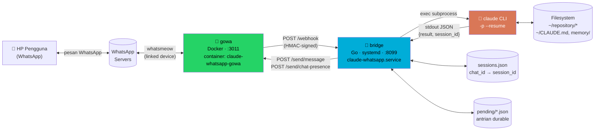
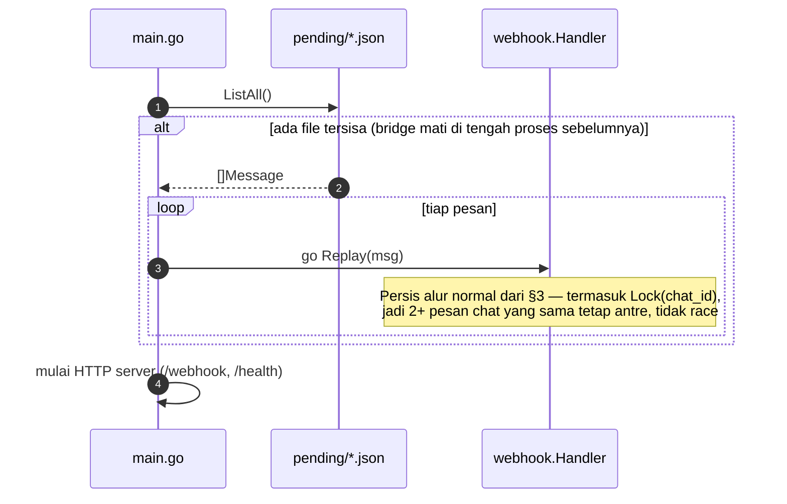
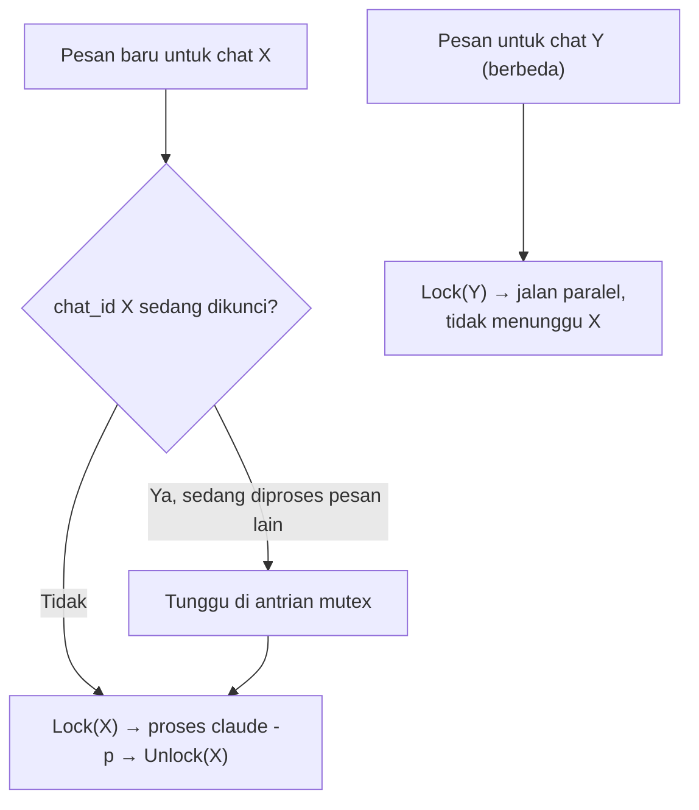

# Arsitektur `claude-whatsapp`

Dokumen ini adalah referensi teknis lengkap: komponen, alur data, sequence diagram, model keamanan, dan keputusan desain — untuk siapa pun (termasuk sesi Claude Code di masa depan) yang perlu memahami sistem ini tanpa harus membaca ulang seluruh riwayat pengembangannya.

## 1. Ringkasan

`claude-whatsapp` menghubungkan WhatsApp ke Claude Code: pesan masuk dari WhatsApp memicu satu panggilan `claude -p`, hasilnya dikirim balik sebagai balasan WhatsApp. Tidak ada proses interaktif yang harus dijaga hidup — setiap pesan ditangani sebagai satu request/response, dengan kontinuitas percakapan dijaga lewat `--resume <session-id>`.

Dibangun 2026-08-28, satu-satunya integrasi WhatsApp↔Claude Code yang aktif di Pi ini.

## 2. Komponen

| Komponen | Teknologi | Peran |
|---|---|---|
| **gowa** | Go + [whatsmeow](https://github.com/tulir/whatsmeow), Docker | Pegang koneksi WhatsApp (linked device) yang sesungguhnya. Kirim webhook saat pesan masuk, terima perintah kirim-pesan lewat REST API. |
| **gowa-media-perms-fix** | Alpine, sidecar Docker | Melonggarkan permission file lampiran yang di-*auto-download* gowa (ditulis `0600` milik uid container, tidak terbaca bridge tanpa ini) — lihat [§7](#7-lampiran-media). |
| **bridge** | Go (custom, repo ini) | HTTP server headless. Terima webhook dari gowa, jalankan `claude -p`, kirim balasan lewat REST API gowa. |
| **claude CLI** | `@anthropic-ai/claude-code` (npm) | Otak sesungguhnya — satu subprocess call per pesan, mode print (`-p`), di-*resume* per `chat_id`. |
| **sessions.json** | File JSON lokal | Peta `chat_id → claude session_id`, supaya panggilan `claude -p` berikutnya untuk chat yang sama pakai `--resume`. |
| **pending/*.json** | File JSON lokal | Antrian durable — satu file per pesan yang sudah di-ack ke gowa tapi belum selesai dibalas. Lihat [§8](#8-durability-pesan). |



## 3. Sequence diagram — satu siklus pesan

```mermaid
sequenceDiagram
    autonumber
    actor U as Pengguna<br/>(WhatsApp)
    participant W as WhatsApp<br/>Servers
    participant G as gowa<br/>(Docker)
    participant B as bridge<br/>(Go)
    participant C as claude CLI
    participant P as pending/*.json
    participant S as sessions.json

    U->>W: Kirim pesan (teks/media)
    W->>G: Deliver (whatsmeow)
    G->>B: POST /webhook<br/>event=message, HMAC di header X-Hub-Signature-256
    activate B
    B->>B: Verifikasi HMAC · filter (is_from_me, allowlist)
    B->>B: buildPrompt() — gabung body/caption +<br/>instruksi lampiran kalau ada (lihat §7)
    B->>P: Write(message_id, prompt, ...)
    Note over P: Ditulis SEBELUM ack — kalau bridge mati<br/>persis setelah ack, ini yang jadi bukti untuk direplay
    B-->>G: 200 OK (ack, wajib <10s)
    deactivate B
    Note over B: Sisanya jalan async<br/>(goroutine terpisah dari HTTP response)

    B->>B: Lock(chat_id) — tunggu giliran kalau ada<br/>pesan lain untuk chat ini sedang diproses (lihat §9)
    B->>G: POST /send/chat-presence<br/>{action: "start"}
    G->>W: Tampilkan "mengetik…"

    B->>S: Get(chat_id)
    S-->>B: prevSessionID (atau kosong)

    B->>C: exec claude -p "<prompt>"<br/>--resume <prevSessionID><br/>--permission-mode auto<br/>cwd=$HOME
    activate C
    Note over C: Baca ~/CLAUDE.md → kalau ada lampiran,<br/>Read file-nya langsung; kalau diminta kerja<br/>di repo tertentu, cd + baca memory repo itu
    C-->>B: JSON {result, session_id, is_error}
    deactivate C

    alt is_error atau exec gagal, DAN ada prevSessionID
        B->>C: Retry: exec claude -p "<prompt>" (tanpa --resume)
        C-->>B: JSON {result, session_id}
    end

    B->>S: Set(chat_id, session_id baru)
    B->>G: POST /send/chat-presence<br/>{action: "stop"}
    B->>G: POST /send/message<br/>{phone: chat_id, message: result}
    G->>W: Kirim balasan
    W->>U: Terima balasan
    B->>P: Done(message_id) — hapus, sudah terjawab
    B->>B: Unlock(chat_id) — giliran pesan berikutnya
```

## 4. Startup — replay pesan pending



## 5. Struktur kode

```
claude-whatsapp/
├── cmd/bridge/main.go          # entrypoint: wiring komponen, replay pending saat startup, HTTP server
├── internal/
│   ├── config/config.go        # baca .env, validasi (ALLOWED_SENDERS & WEBHOOK_SECRET wajib)
│   ├── gowa/client.go          # REST client tipis ke gowa (SendMessage, SetChatPresence, React)
│   ├── webhook/
│   │   ├── handler.go          # verifikasi HMAC, filter, orkestrasi satu siklus pesan
│   │   ├── media.go            # parsing field lampiran polimorfik + buildPrompt()
│   │   └── chatlock.go         # kunci per chat_id — lihat §9
│   ├── claude/runner.go        # exec `claude -p`, parse JSON, retry tanpa --resume kalau gagal
│   ├── session/store.go        # chat_id → session_id, persisted ke JSON, thread-safe (mutex)
│   ├── pending/store.go        # antrian durable, thread-safe lewat rename atomik
│   └── transcribe/whisper.go   # exec whisper-cli untuk transkripsi voice note — lihat §7.1
├── docker-compose.yml          # gowa + sidecar gowa-media-perms-fix
├── deploy/claude-whatsapp.service.template   # unit systemd --user (placeholder path/PATH)
├── scripts/deploy.sh           # build + generate unit dari template + install, idempotent
├── scripts/setup-whisper.sh    # build whisper.cpp + download model (opsional)
└── .env.example                # semua env var terdokumentasi
```

Alur import: `main.go` → `webhook.Handler` → (`gowa.Client`, `claude.Runner`, `session.Store`, `pending.Store`, `transcribe.Transcriber`). Tidak ada dependency siklik; tiap package `internal/*` berdiri sendiri.

## 6. Model kontinuitas sesi

Setiap `chat_id` WhatsApp punya satu "utas" percakapan Claude Code yang terus di-*resume*:

1. Pesan pertama dari suatu chat → `claude -p "<prompt>"` tanpa `--resume` → Claude membuat sesi baru, `session_id` dikembalikan di JSON output.
2. `session_id` disimpan ke `sessions.json` dengan key `chat_id`.
3. Pesan berikutnya dari chat yang sama → `claude -p "<prompt>" --resume <session_id>` → Claude melanjutkan percakapan yang sama persis seperti sesi interaktif biasa (riwayat, memory yang sudah dibaca, dsb tetap ada dalam konteks).
4. Kalau `--resume` gagal (sesi sudah tidak ada/kedaluwarsa) → bridge otomatis retry SEKALI tanpa `--resume`, supaya chat tidak macet — user tidak perlu tahu ini terjadi, cuma kehilangan histori lama.

Ini artinya bridge sendiri **stateless** soal isi percakapan — semua "ingatan" ada di sesi Claude Code (dikelola `claude` CLI sendiri) dan di memory per-repo (`~/.claude/projects/*/memory/`, lihat `~/CLAUDE.md`). Kalau proses `bridge` di-restart, tidak ada percakapan yang hilang — `sessions.json` tetap ada, tinggal lanjut resume.

**Penting**: `claude -p --resume <id>` tidak dirancang untuk diakses beberapa proses sekaligus pada `session_id` yang sama — lihat [§9](#9-kunci-per-chat-concurrency) untuk kenapa ini penting dan bagaimana bridge menjamin cuma satu proses aktif per chat.

## 7. Lampiran media

Gambar, video, dokumen, dan stiker ditangani. Voice note ditranskrip otomatis secara lokal via `whisper.cpp` (lihat §7.1) kalau sudah di-setup; kalau belum, fallback ke prompt "minta pengirim ketik ulang" seperti sebelumnya.

**Cara kerja:**
1. gowa (dengan `WHATSAPP_AUTO_DOWNLOAD_MEDIA=true`, default-nya sendiri) men-download lampiran ke `/app/statics/media/...` di dalam container, lalu payload webhook-nya berisi path relatif itu (string biasa kalau tanpa caption, atau object `{path, caption}` kalau ada — lihat `internal/webhook/media.go`, `mediaRef.UnmarshalJSON` menangani keduanya).
2. `docker-compose.yml` mount `./data/statics:/app/statics`, jadi path itu juga ada di host — `resolveMediaPath()` menerjemahkannya ke path absolut lewat `GOWA_MEDIA_DIR` (default `./data/statics`, relatif terhadap working directory bridge).
3. **Gotcha yang menghabiskan waktu debug**: entrypoint gowa nge-`chown` folder media itu ke uid internal container (20001) dan menulis file dengan mode `0600` — user host yang menjalankan bridge (uid berbeda) sama sekali tidak bisa baca file itu tanpa perbaikan tambahan. Fix-nya: sidecar `gowa-media-perms-fix` (image `alpine:3.19`, `restart: unless-stopped`) yang loop `chmod -R o+rX /data/statics` tiap 5 detik di volume yang sama — jalan sebagai root (default container biasa), jadi bisa `chmod` file yang bukan miliknya. Kalau lampiran gagal dibaca lagi, cek dulu apakah sidecar ini benar-benar jalan (`docker ps`).
4. `buildPrompt()` menggabungkan caption (kalau ada) dengan instruksi eksplisit berisi path absolut, misalnya untuk gambar: `"[Lampiran gambar: /path/ke/file.jpg — baca file ini untuk melihat isinya sebelum membalas]"`. Tidak ada API multimodal terpisah di mode print (`-p`) — Claude "melihat" gambar lewat tool Read-nya sendiri, dipicu oleh instruksi teks ini.
5. Untuk voice note: lihat §7.1 — kalau transkripsi tersedia dan berhasil, teksnya masuk sebagai `"[Transkrip voice note]: <teks>"`; kalau tidak, fallback ke prompt lama yang minta pengirim ketik ulang.

**Verified**: dites end-to-end 2026-08-29 dengan foto sungguhan lewat WhatsApp, termasuk memastikan sidecar permission-fix bekerja otomatis tanpa intervensi manual pada percobaan kedua dan seterusnya.

### 7.1 Transkripsi voice note (`internal/transcribe`)

Lokal sepenuhnya — `whisper.cpp` (CPU, tanpa GPU) + model multilingual, tidak ada API cloud/biaya per menit. Dibenchmark langsung di Raspberry Pi 5 target (Cortex-A76, 4 thread, audio uji 11 detik):

| Model | Ukuran | Waktu proses | Real-time factor |
|---|---|---|---|
| tiny | 77MB | 1.8 detik | ~6x lebih cepat |
| base (default) | 147MB | 4.8 detik | ~2.3x lebih cepat |
| small | 488MB | 16.1 detik | ~1.5x lebih lambat |

`base` dipilih sebagai default — keseimbangan terbaik akurasi/kecepatan untuk voice note pendek (WhatsApp jarang di atas 1 menit).

**Cara kerja:**
1. `handleMessage()` (goroutine async, bukan `ServeHTTP`) memanggil `transcribe.Transcriber.Transcribe()` — sengaja **tidak** di jalur sinkron webhook, karena gowa cuma kasih ~10 detik untuk ack dan transkripsi (apalagi model `small`) bisa lebih lama dari itu.
2. Audio dinormalisasi lewat `ffmpeg` ke WAV 16kHz mono PCM dulu — voice note WhatsApp datang sebagai Opus-in-Ogg, dan decoder bawaan whisper.cpp (miniaudio) cuma reliable untuk Ogg-Vorbis, bukan Opus.
3. `whisper-cli -nt -np` dipanggil untuk output teks bersih tanpa timestamp/log tambahan.
4. `webhook.FinalizeAudioPrompt()` menggabungkan caption (kalau ada) dengan hasil transkrip, atau fallback ke prompt lama kalau `Transcriber` nil (belum di-setup) atau transkripsi gagal untuk file itu.

**Setup** (opsional, lihat README §6): `scripts/setup-whisper.sh` build `whisper.cpp` dari source dan download model ke `bin/whisper-cli` + `data/whisper/ggml-base.bin`. `newTranscriber()` di `cmd/bridge/main.go` cek keberadaan kedua file itu saat startup — kalau tidak ada, transkripsi nonaktif otomatis tanpa bikin bridge gagal start (fitur opsional, bukan hard dependency).

**Verified**: dites 2026-08-29 — benchmark ketiga ukuran model di atas dijalankan langsung di Pi 5, hasil transkrip akurat (dites pakai sample audio bahasa Inggris bawaan whisper.cpp); implementasi kode diverifikasi build bersih (`go build`, `go vet`).

## 8. Durability pesan

Masalah yang diperbaiki: webhook handler harus ack gowa dalam <10 detik, jadi pekerjaan sesungguhnya (panggil `claude -p`, kirim balasan) jalan di goroutine terpisah, async dari respons HTTP. Kalau proses bridge mati tepat di antara ack dan selesainya goroutine itu, gowa tidak akan retry (sudah dapat 200 duluan) — pesan itu bisa hilang tanpa jejak.

**Solusi** (`internal/pending`): setiap pesan yang lolos filter ditulis ke `~/.claude-whatsapp/pending/<message_id>.json` (nama file dari `message_id`, jadi idempotent kalau ada redelivery) **sebelum** di-ack, dan baru dihapus (`Done()`) setelah balasan — sukses ataupun pesan fallback error — benar-benar terkirim. Kalau `SendMessage` sendiri gagal (bukan error dari Claude, tapi gagal ngirim balasannya), file pending-nya sengaja **tidak** dihapus, supaya restart berikutnya coba lagi.

Saat startup, `main.go` memanggil `pending.Store.ListAll()` dan me-*replay* setiap file yang tersisa lewat `webhook.Handler.Replay()` — persis alur normal, cuma masuknya dari `main.go` bukan `ServeHTTP`. Lihat diagram [§4](#4-startup--replay-pesan-pending).

**Verified**: diuji dengan menyuntik file pending buatan lalu me-restart service — log menunjukkan `pending: found 1 message(s)... replaying`, pesan berhasil dibalas, file terhapus otomatis.

## 9. Kunci per-chat (concurrency)

**Masalah yang ditemukan langsung, live, 2026-08-29**: bridge yang sedang menjalankan fitur whisper.cpp (§7.1) melakukan beberapa kali `scripts/deploy.sh` sambil bekerja — tiap restart mematikan proses `claude -p` yang sedang jalan di tengah, lalu [§4](#4-startup--replay-pesan-pending) me-*replay* pesan yang belum terjawab. Karena `replayPending()` di `main.go` mendispatch **semua** pesan pending sekaligus (`go handler.Replay(m)` per pesan, tanpa menunggu satu sama lain), dua pesan untuk chat yang sama ter-replay **bersamaan** — keduanya menjalankan `claude -p --resume <session_id yang sama>` di waktu yang sama. Hasilnya: satu pesan trivial ("ok, gass") tersangkut bermenit-menit tanpa balasan, dan setiap restart berikutnya mengulang masalah yang sama (replay lagi, race lagi).

**Solusi** (`internal/webhook/chatlock.go`): `chatLocks`, sebuah map `chat_id → *sync.Mutex` yang dibuat on-demand. `handleMessage()` — dipanggil baik dari alur normal (`ServeHTTP`) maupun replay — mengunci `chat_id` di awal dan melepasnya lewat `defer` di akhir. Chat yang berbeda tetap berjalan paralel sepenuhnya (mutex per-key, bukan satu lock global); pesan kedua untuk chat yang **sama** cukup menunggu gilirannya, bukan race.



**Verified**: unit test (`internal/webhook/chatlock_test.go`) membuktikan 20 goroutine untuk `chat_id` yang sama tidak pernah > 1 yang aktif bersamaan, dan 2 `chat_id` berbeda tidak saling memblokir. Di produksi: 5 pesan berturut-turut ke chat yang sama setelah fix di-deploy, semuanya selesai berurutan tanpa macet (`journalctl` menunjukkan 5x `replied ok` berturutan, bukan hang).

Catatan `go test -race` tidak jalan di Pi 5 ini (`ThreadSanitizer: unsupported VMA range` — keterbatasan kernel ARM64, bukan bug kode); test tetap valid dijalankan tanpa `-race`.

## 10. Access control per-grup

`config.IsAllowed(chatID, from)` menggerbang DM dan grup **secara terpisah**:

- **DM** (`chat_id` berakhiran `@s.whatsapp.net`): diproses kalau `from` ATAU `chat_id` ada di `ALLOWED_SENDERS` — sama seperti sebelumnya.
- **Grup** (`chat_id` berakhiran `@g.us`): diproses kalau `chat_id` ada di `ALLOWED_GROUPS` — **`ALLOWED_SENDERS` tidak relevan sama sekali** untuk grup. Sekali sebuah grup di-allowlist, **siapa pun anggota grup itu** bisa memicu bridge, bukan cuma nomor yang ada di `ALLOWED_SENDERS`.

**Kenapa desainnya begitu (bukan per-member di dalam grup):** payload webhook gowa untuk pesan grup tidak menyertakan data mentioned-JID (`payload.mentions` semacamnya tidak ada — sudah dicek langsung ke source gowa, bukan asumsi). Tanpa itu, bridge tidak punya cara membedakan "bot di-mention" dari "pesan biasa di grup", jadi tidak ada dasar teknis untuk mention-gating. Kontrol akses jadi di level grup: keputusan "apakah grup ini boleh pakai bridge" ada di tangan Anda saat mengisi `ALLOWED_GROUPS`, bukan di tangan bridge saat runtime.

**Konsekuensi praktis**: kalau ingin lebih ketat dari "semua anggota grup X boleh", satu-satunya cara sekarang adalah membatasi grup mana yang di-allowlist (grup kecil/tepercaya), bukan membatasi siapa di dalamnya.

**Cara dapat JID grup**: `GET /user/my/groups` di REST API gowa, atau lihat field `chat_id` pada webhook pesan yang sudah pernah masuk dari grup itu.

**Verified**: `internal/config/config_test.go` — DM diizinkan/ditolak sesuai `ALLOWED_SENDERS`, grup diizinkan/ditolak sesuai `ALLOWED_GROUPS` independen dari `ALLOWED_SENDERS` (termasuk kasus: nomor yang ada di `ALLOWED_SENDERS` TIDAK otomatis bisa masuk ke grup yang belum di-allowlist).

## 11. Keamanan

- **HMAC signature**: setiap webhook dari gowa ditandatangani `HMAC-SHA256` pakai `WEBHOOK_SECRET` (header `X-Hub-Signature-256: sha256=<hex>`). Bridge menolak (`401`) request yang signature-nya tidak cocok — lihat `webhook.Handler.validSignature`.
- **Allowlist pengirim**: `ALLOWED_SENDERS` (env var, wajib diisi — bridge menolak start kalau kosong) membatasi siapa saja yang pesannya diproses. Ini nomor HP **pengirim** (`payload.from`), bukan nomor device bridge sendiri.
- **Basic auth ke gowa**: bridge otentikasi ke REST API gowa pakai `GOWA_BASIC_AUTH_USER/PASSWORD` yang sama dengan yang dipasang di gowa lewat flag `--basic-auth`.
- **Permission Claude**: subprocess `claude -p` dijalankan dengan `--permission-mode auto` (classifier permission Claude Code bawaan, bukan `--dangerously-skip-permissions`) — tool call yang berisiko tetap butuh persetujuan/diblokir sesuai kebijakan auto-mode yang sama seperti sesi interaktif biasa.
- **Secrets**: `.env` (berisi `WEBHOOK_SECRET`, password gowa) di-`.gitignore`, tidak pernah masuk git. `.env.example` cuma placeholder.
- **Bukan sandbox**: proses `claude -p` jalan sebagai user Linux biasa yang menjalankan bridge — akses filesystem/perintahnya sama persis dengan yang dimiliki user itu di mesin tersebut. Kalau user itu punya `sudo` tanpa password (umum di setup single-user seperti Raspberry Pi pribadi), Claude yang dipicu lewat WhatsApp juga bisa menjalankan `sudo` — dan ini **benar-benar terjadi** saat implementasi §7.1 (`apt-get install cmake`, `mkdir`/`chown` untuk `data/whisper/` semuanya lewat `sudo` tanpa password, dipicu dari pesan WhatsApp). `--permission-mode auto` adalah jaring pengaman heuristik (classifier bawaan Claude Code), **bukan** batas keamanan formal seperti container terisolasi — pertimbangkan ini sebelum memberi bridge akses ke akun dengan privilese luas.

## 12. Belum diimplementasikan

- Mention-gating di grup (balas cuma kalau di-mention) — tidak bisa dibangun sekarang, gowa tidak expose data mention di webhook (lihat [§10](#10-access-control-per-grup)). Access control per-grup sendiri **sudah ada**, level grup bukan level member.
- Approval tool-call lewat reaction emoji — sebelum tool call berisiko (mis. `sudo`), Claude berhenti dan minta konfirmasi 👍/👎 di WhatsApp. Arah desain yang sudah diriset: `PreToolUse` hooks Claude Code (bisa memblokir tool call, jalan juga di mode `-p`) — belum diimplementasikan, protokol stdin/stdout-nya perlu dites empiris dulu.
- Rate limiting lintas-chat — kunci per-chat ([§9](#9-kunci-per-chat-concurrency)) mencegah race di chat yang sama, tapi belum ada batas jumlah proses `claude -p` paralel across banyak chat berbeda sekaligus.

## 13. Konfigurasi (env var)

| Variabel | Dipakai oleh | Default | Keterangan |
|---|---|---|---|
| `LISTEN_ADDR` | bridge | `:8099` | Alamat HTTP server bridge (nerima webhook) |
| `GOWA_BASE_URL` | bridge | `http://localhost:3011` | Endpoint REST API gowa |
| `GOWA_BASIC_AUTH_USER/PASSWORD` | bridge, gowa | — | Kredensial basic auth REST API gowa |
| `WEBHOOK_SECRET` | bridge, gowa | — (**wajib**) | Kunci HMAC, harus sama di kedua sisi |
| `ALLOWED_SENDERS` | bridge | — (**wajib**) | JID/nomor, pisah koma, yang boleh DM ([§10](#10-access-control-per-grup)) |
| `ALLOWED_GROUPS` | bridge | (kosong = grup nonaktif) | JID grup (`...@g.us`), pisah koma, yang boleh chat ([§10](#10-access-control-per-grup)) |
| `CLAUDE_BIN` | bridge | `claude` | Path binary `claude` CLI |
| `WORK_DIR` | bridge | `$HOME` | cwd tempat `claude -p` dijalankan — ini yang bikin instruksi cross-project di `~/CLAUDE.md` kebaca |
| `SESSION_STORE_PATH` | bridge | `~/.claude-whatsapp/sessions.json` | Lokasi peta chat_id → session_id |
| `PENDING_DIR` | bridge | `~/.claude-whatsapp/pending` | Lokasi antrian durable ([§8](#8-durability-pesan)) |
| `GOWA_MEDIA_DIR` | bridge | `./data/statics` | Path host tempat `/app/statics` gowa di-mount ([§7](#7-lampiran-media)) |
| `WHISPER_BIN` | bridge | `./bin/whisper-cli` | Binary whisper.cpp — lihat [§7.1](#71-transkripsi-voice-note-internaltranscribe) |
| `WHISPER_MODEL` | bridge | `./data/whisper/ggml-base.bin` | Model ggml whisper.cpp |
| `FFMPEG_BIN` | bridge | `ffmpeg` | Untuk normalisasi Opus-in-Ogg → WAV sebelum transkripsi |
| `WHISPER_LANG` | bridge | `auto` | Kode bahasa whisper, atau `auto` untuk deteksi per-klip |
| `GOWA_PORT` | docker-compose | `3011` | Port host untuk gowa |

## 14. Deployment & persistence

- **gowa + sidecar**: Docker Compose, `docker compose up -d` (menjalankan `gowa` dan `gowa-media-perms-fix` sekaligus). Persistence koneksi WhatsApp ada di volume `./data/whatsapp` (sqlite whatsmeow store); lampiran media di `./data/statics`.
- **bridge**: dibangun jadi binary native (`go build -o bin/bridge ./cmd/bridge`), dipasang sebagai `systemd --user` service (`deploy/claude-whatsapp.service.template`, di-generate `scripts/deploy.sh` dengan path & `$PATH` mesin masing-masing) — `Restart=always`, `RestartSec=5`. Tidak ada TTY/prompt interaktif sama sekali — restart otomatis systemd langsung jalan bersih, tanpa langkah tambahan.
- Redeploy setelah ubah kode: `scripts/deploy.sh` (idempotent — build ulang, `daemon-reload`, `restart` eksplisit supaya binary baru benar-benar terpakai, bukan cuma `enable --now` yang diam-diam skip restart kalau service sudah jalan). **Ingat**: tiap restart mematikan proses `claude -p` yang sedang jalan — normal untuk deploy sesekali, tapi hindari redeploy berkali-kali beruntun saat ada percakapan aktif (lihat [§9](#9-kunci-per-chat-concurrency) untuk kenapa ini pernah jadi masalah).
- Cek status: `systemctl --user status claude-whatsapp.service`, `docker logs claude-whatsapp-gowa`, `docker ps` (pastikan `gowa-media-perms-fix` juga `Up`), `journalctl --user -u claude-whatsapp.service -f`.

## 15. Referensi API gowa yang dipakai

| Endpoint | Method | Dipakai untuk |
|---|---|---|
| `/webhook` (di sisi bridge) | POST | Terima event `message` dari gowa |
| `/send/message` | POST | Kirim balasan teks. Body: `{phone, message}` |
| `/send/chat-presence` | POST | Indikator "mengetik". Body: `{phone, action}` — **`action` cuma terima `"start"`/`"stop"`**, bukan `"composing"`/`"paused"` (gotcha, lihat memory repo) |
| `/message/{id}/reaction` | POST | Reaksi emoji (belum dipakai bridge, tersedia di client). Body: `{phone, emoji}` |
| `/devices` | POST | Buat device slot baru (dipakai sekali saat pairing) |
| `/app/login-with-code` | GET | Minta kode pairing — perlu `?device_id=` walau endpoint "legacy" |
| `/app/status` | GET | Cek status login sesungguhnya (`is_logged_in`) — lebih bisa dipercaya dari field `state` di `/devices/{id}` |

Detail lengkap format payload webhook: `~/repository/go-whatsapp-web-multidevice/docs/webhook-payload.md` (clone lokal repo gowa).
